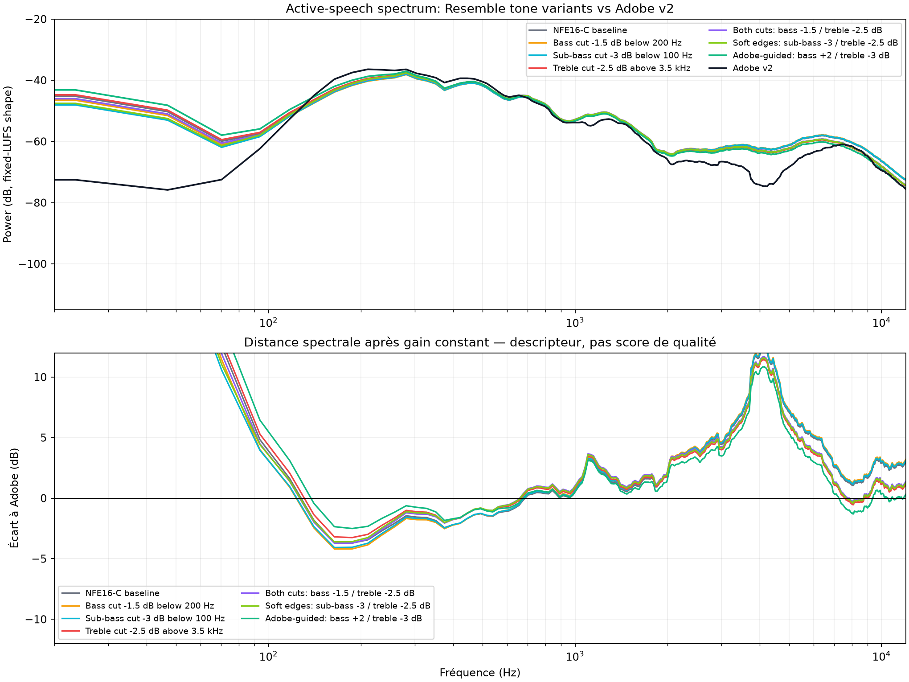
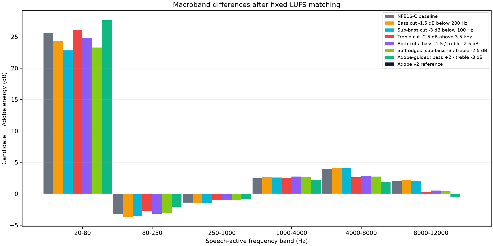
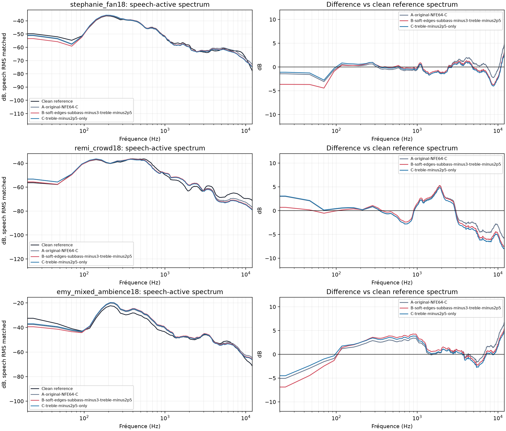
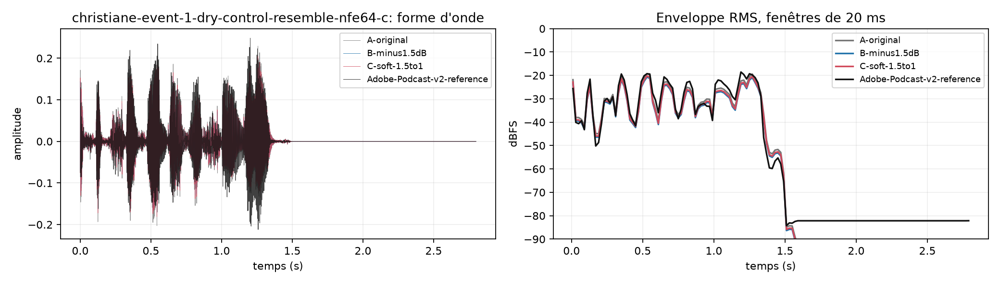

# Façonnage doux des graves et aigus — comparaison Adobe v2

**Date : 9 octobre 2026.** Cette étude mesure un étage tonal placé après le
Resemble Enhance déjà rendu. Elle teste séparément sous-grave, grave et aigu
pour éviter de confondre « rendre la voix plus douce » avec baisser tout le
volume ou retirer tout le grave.

## Résumé des observations

Sur la paire bruitée pour laquelle l'entrée exacte et une sortie Adobe v2 sont
disponibles, le NFE16-C contenait environ **25,6 dB de plus entre 20–80 Hz**,
mais **3,2 dB de moins entre 80–250 Hz**, que la sortie Adobe après gain fixe
de comparaison. Il avait aussi environ **3,9 dB de plus en 4–8 kHz** et
**2,0 dB de plus en 8–12 kHz**. Le bas 20–80 Hz est donc dominé par un
sous-grave/rumble résiduel dans cet exemple; couper tout le grave jusqu'à
200 Hz enlève aussi de la chaleur dont Adobe garde davantage.

Le profil expérimental **soft-edges** coupe le sous-grave (−3 dB sous 100 Hz)
et adoucit l'aigu (−2,5 dB au-dessus de 3,5 kHz), en conservant le grave
80–250 Hz. Sur la paire Adobe, son erreur moyenne de courbe spectrale lissée
entre 20 Hz et 12 kHz passe de **3,92 à 3,02 dB**. Le trim aigu seul atteint
2,93 dB; le profil « Adobe-guided » (+2 dB sous 200 Hz, −3 dB au-dessus de
3,5 kHz) atteint 2,56 dB, mais il augmente le grave général et n'est donc pas
le profil choisi pour l'écoute demandée.

Sur trois autres voix NFE64-C avec bruit contrôlé, soft-edges baisse le LUFS-I
de 0,31 à 0,49 dB, le sous-grave de 1,52 à 2,10 dB et les bandes 4–8 / 8–12
kHz de 0,69–1,21 / 1,18–1,66 dB. La crête vraie 4× baisse de 0,05 à 0,63 dB.
L'écart spectral à la référence propre s'améliore sur deux voix et se dégrade
sur une : ce résultat ne justifie donc pas un preset automatique universel.

La sortie Adobe réduit encore de **24,7 dB** le RMS médian des fenêtres entre
phrases par rapport au NFE16-C de référence. Soft-edges ne gagne que 2,4 dB
sur ce descripteur. L'EQ ne remplace donc pas le débruitage.

## Spectres mesurés







### Courbe des écarts spectraux appariés

| Variante | MAE spectrale 20 Hz–12 kHz vs Adobe | Écart 20–80 Hz | Écart 80–250 Hz | Écart 4–8 kHz | Écart 8–12 kHz |
| --- | ---: | ---: | ---: | ---: | ---: |
| NFE16-C existant | 3,92 dB | +25,6 dB | −3,2 dB | +3,9 dB | +2,0 dB |
| Coupe large grave −1,5 dB sous 200 Hz | 4,12 dB | +24,3 dB | −3,7 dB | +4,2 dB | +2,2 dB |
| Coupe sous-grave −3 dB sous 100 Hz | 4,03 dB | +22,8 dB | −3,5 dB | +4,1 dB | +2,1 dB |
| Trim aigu −2,5 dB au-dessus de 3,5 kHz | **2,93 dB** | +26,0 dB | −2,7 dB | +2,6 dB | +0,3 dB |
| Coupe large grave + aigu | 3,10 dB | +24,8 dB | −3,2 dB | +2,9 dB | +0,5 dB |
| **Soft-edges : sous-grave + aigu** | **3,02 dB** | +23,3 dB | −3,1 dB | +2,8 dB | +0,4 dB |
| Adobe-guided : grave +2 dB, aigu −3 dB | 2,56 dB | +27,6 dB | −2,0 dB | +1,9 dB | −0,5 dB |

Les écarts sont **candidat moins Adobe**, à niveau fixé par gain constant sur
le stem sec. Le 20–80 Hz peut contenir du rumble et du bruit présent pendant la
parole; ce n'est pas une mesure isolée de la fondamentale vocale. Les deux
bandes entre phrases et les spectres actifs sont donc rapportés séparément.

### Effet sur trois autres voix

Les chiffres ci-dessous comparent les sorties NFE64-C existantes à des copies
traitées par soft-edges, sans ré-inférer le modèle. Le « MAE vs propre » est
calculé après égalisation du RMS vocal médian à la référence propre; c'est un
descripteur spectral, pas une mesure de qualité perçue.

| Voix / bruit | Δ LUFS-I | Δ crête vraie 4× | Δ énergie 20–80 Hz | Δ 4–8 kHz | Δ 8–12 kHz | MAE spectrale vs propre, avant → après |
| --- | ---: | ---: | ---: | ---: | ---: | ---: |
| Stéphanie / ventilateur | −0,49 dB | −0,29 dB | −2,10 dB | −1,06 dB | −1,56 dB | 3,33 → 2,53 dB |
| Rémi / foule | −0,31 dB | −0,63 dB | −1,90 dB | −1,21 dB | −1,66 dB | 3,05 → 3,66 dB |
| Emy / ventilateur + foule | −0,36 dB | −0,05 dB | −1,52 dB | −0,69 dB | −1,18 dB | 4,62 → 3,85 dB |



## Choix produit

Un preset optionnel `--tone soft-edges` a été ajouté au runner Resemble. Il
applique d'abord le ton C existant (étagère −1,5 dB à 5,5 kHz), puis deux
étagères causales sans anticipation : −3 dB sous 100 Hz et −2,5 dB au-dessus
de 3,5 kHz. Aucun limiteur ni gain de compensation n'est ajouté. L'option C
reste le défaut : un essai sur trois a un MAE spectral plus élevé après le
filtre, donc le preset ne doit pas être présenté comme universel.

Exemple (après installation locale des poids et de l'environnement Resemble) :

```sh
python3 -m voxrefine studio-resemble input.wav results/voice-soft-edges.wav \
  --model-python .tools/resemble-venv/bin/python \
  --upstream .tools/resemble-enhance-src \
  --model-dir results/resemble-enhance-01/model/enhancer_stage2 \
  --device auto --nfe 64 --chunk-seconds 3 \
  --tone soft-edges --treble-trim-db -1.5 \
  --report results/voice-soft-edges.json
```

## Méthode et reproduction

La paire Adobe est un extrait de 6 secondes de [La Fortune des Rougon lu par
Bidou](https://commons.wikimedia.org/wiki/File:Fortunedesrougon_02_zola_128kb.mp3),
marqué Public Domain Mark, avec [ambiance de classe du domaine public](https://commons.wikimedia.org/wiki/File:Ambient_classroom_mono.ogg),
SNR nominal 10 dB. C'est une seule voix et un seul réglage Adobe; l'export
Adobe v2 est conservé localement et n'est pas redistribué dans Git. L'activité
vocale provient du stem sec connu et reçoit une garde de ±60 ms. Les spectres
sont lissés par bandes de 1/6 d'octave, calculés uniquement sur les trames
actives, puis appariés en LUFS-I au stem sec. Les fichiers d'écoute locaux
sont appariés au LUFS-I du NFE16-C de référence pour isoler le timbre.

La deuxième matrice emploie les stems propres exacts de trois voix NFE64-C à
SNR actif mesuré 18 dB. Les fichiers source et sorties audio restent locaux.
Le rapport de provenance contient empreintes SHA-256 des fichiers, versions
NumPy/SciPy/SoundFile/Matplotlib, nombres de trames et toutes les mesures.

```sh
.tools/resemble-venv/bin/python \
  scripts/benchmarks/universal_enhancer/tone_balance_sweep.py \
  --current-sample results/clear-noisy-mix-01/audio/stephanie_fan18-resemble-nfe64-C.wav \
  --current-sample results/clear-noisy-mix-01/audio/remi_crowd18-resemble-nfe64-C.wav \
  --current-sample results/clear-noisy-mix-01/audio/emy_mixed_ambience18-resemble-nfe64-C.wav
```

CSV complet : [paire Adobe et sept variantes](data/tone-balance-adobe-metrics-2026-10-09.csv),
[trois autres voix](data/tone-balance-current-samples-2026-10-09.csv).
JSON de provenance : [protocole, empreintes, versions et mesures](data/tone-balance-adobe-report-2026-10-09.json).
La commande crée aussi des WAV/MP3 A/B/C locaux sous
`results/tone-balance-adobe-01/current-samples/`; les rendus audio ne sont pas
ajoutés au dépôt.

Limites : les spectres ne sont pas une écoute, les recordings ne couvrent
qu'un corpus de lecture contrôlé, et la sortie générative Resemble change la
phase; les métriques par projection échantillon-à-échantillon ne sont pas
pertinentes ici. Le calcul du filtre est causal, mais ce benchmark ne mesure
pas la latence du pipeline complet ni une capture microphone temps réel.
