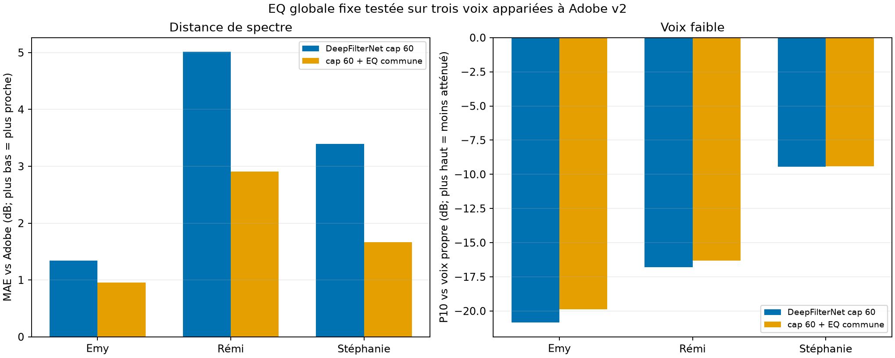
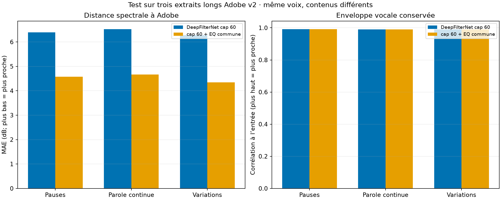

# DeepFilterNet cap 60 et EQ fixe contre Adobe v2 — 2026-10-09

## Question

DeepFilterNet cap 60 est le traitement préféré par l'utilisateur sur les derniers essais. Cette passe garde cette réduction comme base et cherche une correction tonale commune qui rapproche ses courbes d'Adobe Podcast v2, sans réduire davantage les trames faibles. Les fichiers bruts restent locaux dans `results/`; les graphiques et le CSV agrégé sont publiés ici.

## Correction testée

Une validation croisée « une voix laissée de côté » balaie 100 corrections à shelves statiques : grave de −2 à +2 dB, coin à 100 ou 200 Hz; aigu de −3 à +1 dB, coin à 3,5 ou 5 kHz. À chaque pli, les paramètres sont choisis sur deux voix puis mesurés sur la troisième. Aucun compresseur ni gain variable n'est utilisé pour l'évaluation spectrale; chaque courbe candidate et Adobe est appariée au niveau RMS actif de la voix de référence.

Les trois plis choisissent le même shelf aigu (**−3 dB à 3,5 kHz**) et un léger shelf grave (**+1 ou +2 dB à 200 Hz**). Une correction fixe intermédiaire **+1,5 dB à 200 Hz et −3 dB à 3,5 kHz** est ensuite passée sur l'ensemble des trois voix et sur les extraits réverbérés. Les shelves sont de premier ordre; la valeur de gain est atteinte progressivement autour du coin, ce n'est pas une coupe abrupte.

## Trois voix bruitées : test laissé de côté

| Voix tenue à l'écart | Cap 60 MAE vs Adobe (dB) | EQ choisie sans cette voix (dB) | Amélioration | P10 faible après gain d'entraînement, avant → après |
|---|---:|---:|---:|---:|
| Emy | 1,34 | **1,19** | 0,15 dB | −23,21 → −21,82 dB |
| Rémi | 5,01 | **3,10** | 1,91 dB | −21,54 → −21,40 dB |
| Stéphanie | 3,40 | **1,80** | 1,60 dB | −15,06 → −15,38 dB |
| Médiane | 3,40 | **1,80** | 1,60 dB | −21,54 → −21,40 dB |

L'erreur spectrale baisse dans chacun des trois plis. L'enveloppe parlée change très peu (corrélations environ 0,918, 0,988 et 0,987 après EQ); le p10 faible change de −0,32 à +1,39 dB. Le résultat est encourageant sur ces trois voix, mais trois plis d'un même petit corpus ne valident pas un preset universel.

La correction fixe intermédiaire évaluée sur les mêmes trois paires donne une MAE médiane de **1,66 dB**, contre **3,40 dB** pour cap 60 seul. Comme ce réglage résume les valeurs déjà choisies dans les plis, ce score global est descriptif et ne remplace pas la validation laissée de côté.



## Extraits longs appariés à Adobe

DeepFilterNet cap 60 a été exécuté sur trois extraits de 38–39 secondes issus de la même lecture publique de *La Fortune des Rougon*. Les exports Adobe v2 correspondent aux mêmes segments. On utilise une activité de parole déduite du niveau de l'entrée, puis on apparie les niveaux actifs pour calculer la MAE spectrale 80 Hz–12 kHz. Il n'y a pas de stem propre pour cette source; la corrélation d'enveloppe et le p10 faible sont donc comparés à l'entrée, pas à une vérité terrain propre.

| Segment | MAE cap 60 (dB) | MAE cap 60 + EQ (dB) | Corrélation enveloppe entrée → cap 60 / EQ | P10 faible entrée → cap 60 / EQ |
|---|---:|---:|---:|---:|
| Pauses nombreuses | 6,39 | **4,57** | 0,992 / 0,992 | −5,44 / −5,44 dB |
| Parole continue | 6,53 | **4,66** | 0,990 / 0,991 | −4,51 / −4,28 dB |
| Variations d'intensité | 6,28 | **4,34** | 0,990 / 0,990 | −5,37 / −5,21 dB |

L'écart spectral baisse de 1,81 à 1,87 dB sur les trois segments. Ils viennent toutefois d'une seule voix, alors ils testent surtout la variation du texte et du rythme, pas la diversité des timbres.



| Segment | Temps CPU cap 60 | Durée | RTF |
|---|---:|---:|---:|
| Pauses nombreuses | 7,78 s | 39,36 s | 0,20 |
| Parole continue | 8,14 s | 39,46 s | 0,21 |
| Variations d'intensité | 8,02 s | 38,14 s | 0,21 |

Le RTF inférieur à 1 signifie que ces fichiers ont été traités plus vite que leur durée sur cette machine; il ne mesure pas la latence de traitement micro en direct.

## Contrôle réverbération

Sur les trois rendus Adobe appariés réverbérés déjà traités par DeepFilterNet cap 60, la même EQ réduit aussi la MAE spectrale : Christiane 1 **7,86 → 5,96 dB**, Christiane 2 **5,26 → 4,28 dB**, Naf 2 **7,50 → 7,07 dB**. La métrique de réduction de queue change de moins de 0,3 dB pour chaque cas. L'EQ corrige la tonalité; elle n'ajoute donc pas d'annulation d'écho ou de réverbération mesurable ici. La mesure de queue de Christiane 1 reste limitée par le plancher de bruit Adobe.

## Niveau de sortie : mesure distincte

Dans le précédent corpus bruité, le niveau médian de parole natif de cap 60 est environ **2,66 dB au-dessus** d'Adobe. La correction EQ seule ne réduit pas ce niveau; avec ses basses relevées, elle le monte légèrement. Le gain entraîné dans les plis pour viser le niveau Adobe varie entre **−2,36 et −5,63 dB**. Même avec ce gain ajusté sur les deux autres voix, la voix mise de côté reste entre **−4,53 et +6,67 dB** d'écart au niveau Adobe : le niveau cible varie beaucoup selon la voix et l'extrait. Une simple atténuation globale fixe ne reproduit donc pas son comportement de niveau.

Je garde le gain de sortie comme étape distincte à mesurer (par exemple cible de loudness stable avec protection de crête), sans le confondre avec le rapprochement spectral. Cette passe n'active aucun nouveau réglage par défaut dans le moteur produit.

## Écoute niveau apparié

Les sorties ci-dessous appairent le niveau actif d'Adobe pour faciliter la comparaison de timbre. Le niveau est ajusté uniquement pour ces fichiers d'écoute; ce n'est pas le gain de production recommandé.

- Les trois WAV de comparaison du segment « parole continue » sont produits dans `results/adobe-v2-dfn60-global-tone-2026-10-09/listening-levelmatched/` : Adobe v2, cap 60 et cap 60 + EQ commune.

- [CSV des mesures principales](assets/adobe-v2-dfn60-global-tone-2026-10-09/metrics.csv)

## Reproduction

Avec les exports Adobe v2 déjà récupérés localement, les stems et le binaire DeepFilterNet dans `.tools/` :

```bash
.venv/bin/python scripts/benchmarks/universal_enhancer/challenge_dfn60_global_tone.py
```

Le script regénère les cap 60 longs, les niveaux d'écoute appariés, les mesures de réverbération disponibles localement, les tableaux et les deux figures. Les entrées corpus, les exports Adobe et WAV de résultat sont dans `corpus/` et `results/`, ignorés par Git; les sources, rapports et figures sont suivis dans le dépôt.

## Suite

Garder **DeepFilterNet cap 60 comme base d'essai**, selon ton appréciation. Garder l'EQ commune comme candidate de finition : ses améliorations spectrales se répètent sur trois voix bruitées, les trois segments longs et les trois événements réverbérés. Avant de l'intégrer au preset produit, l'évaluer sur plusieurs nouvelles voix indépendantes, des enregistrements propres et du clipping; puis régler séparément le niveau final sans faire baisser les consonnes faibles.
