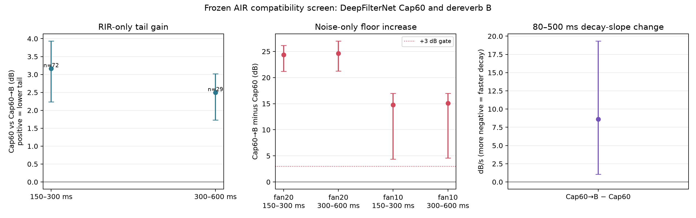

# AIR Cap60–dereverb factorial — 2026-10-10

## Question and decision

Does the project's acoustically preferred DeepFilterNet Cap60 output make a suitable input for the frozen compact dereverberator B? This paired diagnostic replays the exact 12-speaker/eight-AIR-RIR cases from the completed DPDFNet2 cascade screen, with matched dry, reverberant, and controlled-noise inputs.

**Decision: do not integrate Cap60→B unchanged.** B lowers measurable RIR-only tail energy, but also lifts the noise-only output floor by 15–25 dB and attenuates dry speech/onsets beyond the predeclared limits. The pause-decay slope becomes less steep after B, so the energy reduction does not demonstrate faster decay. The chain fails the frozen quality gates. No Adobe equivalence claim follows from this synthetic controlled-RIR screen.

## Frozen method

- Replay 96 paired cases: 12 fresh LibriSpeech `train-clean-360` speakers × eight measured AIR v1.4 RIRs (booth, lecture, meeting, office; short and long distance). The same speakers and RIRs were used in the earlier DPDFNet2 interaction test; this is a denoiser-compatibility diagnostic, not an independent final holdout.
- Two routes only: DeepFilterNet with `--atten-lim-db 60 --compensate-delay`, and that output passed through the frozen 16 kHz B model (555,922 parameters). Both routes use the same PCM16 Cap60 input. No model was trained or tuned from this screen.
- Four paired signal conditions per speaker/RIR: dry control, RIR only, RIR with synthetic fan-like noise at 20 dB SNR, and RIR with the same noise design at 10 dB SNR. Each noisy input also has its matched noise-only control. The fixed-seed noise is band-limited Gaussian with weak 120/240 Hz tones, not a recording of a real fan.
- Tails use the same reverberant speech reference for both routes. A pair is censored if either route is within 3 dB of the larger matched dry/noise-only output floor. Speech metrics exclude the initial 200 ms. The decay-slope diagnostic is a Theil–Sen fit from 80–500 ms after the first clean speech end, using frames above the pair's common output floor +3 dB.
- The DeepFilterNet file interface trims exactly 480 samples (30 ms) from every 16 kHz output, with zero-sample start offset in the pilot. All measurements use the shared available prefix; no artificial padding is scored.
- Statistics pair by speaker/RIR and bootstrap speakers as clusters (5,000 resamples). Four room medians are shown separately; correlated speaker/RIR rows are not treated as independent rooms.
- Audit: 576 Cap60 output WAVs; 768 unique metric rows (192 each for dry, RIR-only, fan20, fan10); 384 rows per route; 96 unique speaker/RIR pairs; all 12 speakers present. SNR ranges were 20.0000–20.0000 dB and 10.0000–10.0000 dB before PCM16 quantization. `test.wav` was not read or processed.

LibriSpeech is distributed under [CC BY 4.0](https://www.openslr.org/12/). AIR v1.4 is identified as MIT in the included dataset license/readme; cite Marco Jeub et al., Aachen Impulse Response Database (DSP 2009; ICA 2010), and consult the [AIR database page](https://www.iks.rwth-aachen.de/en/research/tools-downloads/databases/aachen-impulse-response-database).

## RIR-only results

Positive tail gain means Cap60→B has lower energy than Cap60 in that window. CIs are speaker-cluster bootstrap intervals, and only pairs above both routes' common floor are included.

| Measure | Median | 95% CI | Measurable pairs |
|---|---:|---:|---:|
| Tail gain, 150–300 ms | **+3.17 dB** | +2.23 to +3.94 | 72/96 |
| Tail gain, 300–600 ms | **+2.50 dB** | +1.73 to +3.02 | 29/96 |
| Cap60 pause-decay slope, 80–500 ms | −118.37 dB/s | −160.77 to −51.89 | 82/96 |
| Cap60→B pause-decay slope | −104.19 dB/s | −132.68 to −39.49 | 82/96 |
| Slope change, Cap60→B minus Cap60 | **+8.60 dB/s** | +1.07 to +19.35 | 79/96 |

Tail gain was positive in all four locations among measurable pairs: 150–300 ms medians were booth +1.87, lecture +3.79, meeting +2.70, office +4.42 dB; 300–600 ms medians were booth +1.52, lecture +2.57, meeting +2.71, office +3.35 dB. The late window has 67/96 censored pairs, so its result has materially less coverage.

The positive slope change means the fitted decay after B was **less negative**, not steeper. Thus, the lower tail energy alone is insufficient evidence that B shortened the room decay. The slope and windowed-energy measures describe different aspects of the output and should be reported together.

## Noise floor and speech preservation

| Noise-only output floor increase after B | Median | 95% CI |
|---|---:|---:|
| fan20, 150–300 ms | **+24.34 dB** | +21.22 to +26.17 |
| fan20, 300–600 ms | **+24.62 dB** | +21.25 to +27.02 |
| fan10, 150–300 ms | **+14.74 dB** | +4.39 to +16.98 |
| fan10, 300–600 ms | **+15.06 dB** | +4.61 to +16.98 |

This is the clearest failure: B adds a substantial quiet-output residual after Cap60. Consequently, noisy tail comparisons are mostly censored: at 150–300 / 300–600 ms, 4/96 / 0/96 fan20 pairs and 10/96 / 0/96 fan10 pairs were measurable. Those few uncensored noisy pairs are descriptive only and do not establish a noise-condition gain.

| Dry-control change from adding B | Median | 95% CI | Gate |
|---|---:|---:|---|
| Active speech p50 | −1.12 dB | −1.60 to −0.91 | fail: must be above −1 dB |
| Onset p10 | −1.46 dB | −1.72 to −1.14 | fail: must be above −1 dB |
| Weak-frame p10 | −1.70 dB | −2.13 to −1.34 | pass: within ±3 dB |
| Weak-frame p50 | −2.10 dB | −2.23 to −1.93 | pass: within ±3 dB |

The predeclared tail-energy gates passed on RIR-only cases (+2 dB at 150–300 ms, +1 dB at 300–600 ms, positive in at least 3/4 locations). The floor and two speech gates failed, so the overall candidate gate failed.



## Runtime and limits

- Cap60 processed 4,995 s of staged PCM audio in 1,011.1 s wall time (aggregate RTF 0.202). This is the local CPU CLI batch measurement, including process startup and file I/O.
- B forward passes totalled 17.11 s on the GTX 1050 Ti CUDA path across 576 signals (about 29.7 ms per signal; RTF approximately 0.0034). This excludes WAV writing, input staging, and model initialization.
- The Cap60→B combination uses an offline whole-clip dereverberator and is not a real-time/streaming validation.
- The noise is synthetic; the four AIR locations are limited and the AIR responses were used in an earlier screen. The 4 s source crops form controlled offsets with an inserted pause, not conversational long-form audio. Floor censoring limits coverage in the late and noisy windows.

## Next experiment

The unmodified Cap60→B chain is a **no-go**. It reduces some measured tail energy, but its lifted output floor and dry-speech attenuation make it unsafe to add unchanged to the preferred denoiser. The slope result further weakens a claim of true tail shortening.

The next experiment should train a Cap60-input-aware B using only known clean speech plus licensed/measured or procedural RIR/noise pairs—without Adobe outputs—and evaluate once on both unseen speakers and unseen measured rooms. Keep the architecture small and add a training target that preserves the direct/early speech while penalizing output noise floor. Do not choose a checkpoint or tune gates on the holdout. If that held-out model still raises floor or attenuates onset speech, keep dereverb outside this Cap60 live chain and investigate a different architecture or end-to-end trained chain. The exact training recipe and held-out gate should be frozen before training begins.

## Reproduction

The row-level inputs and outputs are local, ignored artifacts in `.tools/compact-dereverb/air-cap60-b-factorial-2026-10-10/`; the repository contains aggregate statistics and this figure only. The frozen input manifest is `.tools/compact-dereverb/air-dpdfnet-factorial-2026-10-09/manifest.json`.

```bash
.tools/resemble-cuda-venv/bin/python scripts/benchmarks/universal_enhancer/compact_dereverb/bench_air_cap60_factorial.py \
  --device cuda
```

The full command refuses to overwrite an existing output directory. To rebuild the summary and plot from an already completed `cases.jsonl` without rerunning Cap60 or B:

```bash
.tools/resemble-cuda-venv/bin/python scripts/benchmarks/universal_enhancer/compact_dereverb/bench_air_cap60_factorial.py \
  --device cuda --analyze-existing
```
