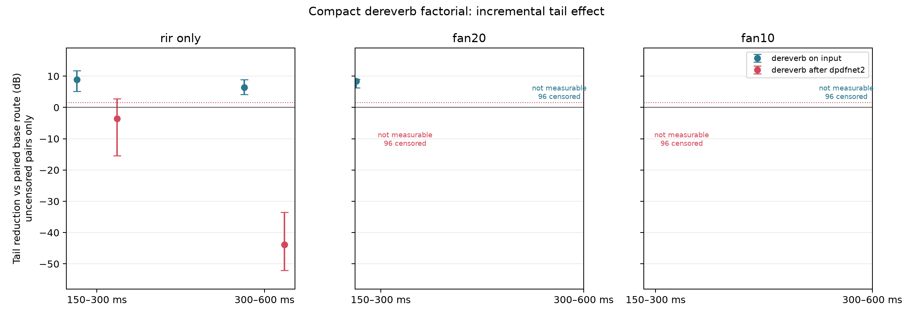

# AIR dereverb–DPDFNet2 factorial — 2026-10-10

## Question and verdict

This frozen experiment asks whether the compact 16 kHz dereverberator (B) shortens measured-room speech tails by itself, and whether that effect survives after DPDFNet2 denoising. It also checks dry-speech preservation and the output floor with a controlled fan-like noise proxy. It does **not** compare with Adobe Podcast and cannot establish Adobe parity, universal quality, or live performance.

**Decision: do not use B after DPDFNet2 in the current product chain.** B has a clear tail-reduction effect on reverberant input alone, but fails both post-DPDF tail gates and the incremental speech-preservation gates. On noisy input, most tail estimates are censored by the measured output floor, so those tail results are inconclusive. The noise-only diagnostic points to a serious domain interaction: B raises the DPDFNet2-only noise floor by roughly 65–68 dB in these controlled cases.

## Frozen protocol

- 12 fresh LibriSpeech `train-clean-360` speakers, each represented by two successive utterances cropped to at most 4 s each. The clips are joined with an 800 ms inserted pause, yielding an 8.8 s controlled-offset test. Crops are not claimed to end at natural phrase boundaries.
- Eight measured AIR v1.4 impulse responses: booth, lecture, meeting, and office, each with short and long source distance. Full convolution is retained through the scored tail windows. The AIR responses appeared in an earlier dereverb screen; this is a fresh-speaker cascade-interaction screen, not a new room-level holdout.
- Four paired routes: unchanged input, B, DPDFNet2, and DPDFNet2→B. Each signal is processed at 16 kHz for B; DPDFNet2 uses its 48 kHz streaming adapter and is aligned back to the original sample count.
- Conditions: RIR only; RIR plus fixed-seed band-passed Gaussian noise with weak 120/240 Hz tones, calibrated to 20 or 10 dB active-speech SNR. This is a reproducible fan-like proxy, not a real fan recording. The measured SNR percentiles were within 0.000001 dB of their nominal values.
- The tail level uses one fixed reverberant-input speech reference for every route. A tail comparison is censored if either branch is within 3 dB of the higher matched dry-control/noise-only output floor. The 150–300 ms and 300–600 ms windows are reported separately. Speech preservation uses clean-only activity and excludes the first 200 ms of model startup.
- Statistics pair by speaker/RIR and bootstrap speakers as clusters (5,000 resamples). Room medians are also reported separately; repeated RIR pairs are not treated as independent rooms.
- 1,536 unique rows were audited: 384 each for dry control, RIR-only, fan20, and fan10. All four arms have the expected counts. The analysis uses a frozen checkpoint and no tuning against these results. `test.wav` was not read or processed.

The clean speech is LibriSpeech, distributed under [CC BY 4.0](https://www.openslr.org/12/). AIR v1.4 is identified as MIT in the included dataset license/readme; cite Marco Jeub et al., Aachen Impulse Response Database (DSP 2009; ICA 2010), and consult the [AIR database page](https://www.iks.rwth-aachen.de/en/research/tools-downloads/databases/aachen-impulse-response-database).

## Primary tail results

Positive gain means the tail level went down relative to the paired base route. The confidence interval is a speaker-cluster bootstrap interval. Only uncensored pairs contribute to the median.

| Condition / route | 150–300 ms gain | 300–600 ms gain |
|---|---:|---:|
| RIR-only: B vs input | **+8.92 dB** (95% CI +5.12 to +11.78; 93/96 valid) | **+6.46 dB** (+4.19 to +8.93; 91/96 valid) |
| RIR-only: DPDFNet2→B vs DPDFNet2 | **−3.55 dB** (−15.44 to +2.74; 41/96 valid) | **−43.90 dB** (−52.02 to −33.50; 27/96 valid) |

For B on reverberant input, room medians were positive in all four AIR locations in both windows. After DPDFNet2, only 1/4 locations was positive in 150–300 ms and 0/4 in 300–600 ms. The far tail has extensive floor censoring; the negative observed medians describe only the remaining measurable pairs and should not be generalized to censored pairs.

### Controlled noise conditions

| Condition | B vs input: measurable tail pairs (150–300 / 300–600 ms) | DPDFNet2→B vs DPDFNet2 |
|---|---:|---:|
| fan20 | 5/96 / 0/96 | 0/96 / 0/96 |
| fan10 | 0/96 / 0/96 | 0/96 / 0/96 |

Because nearly all noisy tails are within the common output floor, the correct result is **not measurable under this censoring rule**, rather than “no dereverberation.” The separate noise-only floor comparison is measurable: DPDFNet2 lowers the median noise floor by about 93 dB at fan20 and 100 dB at fan10 relative to input, while DPDFNet2→B lowers it by only about 26 dB and 36 dB, respectively. In the direct DPDFNet2 vs DPDFNet2→B comparison, B raises the floor by **67.7 dB** at fan20 and **64.8 dB** at fan10 (150–300 ms; similar in 300–600 ms). These extreme values are relative to the fixed wet-speech reference and are specific to the synthetic noise route and this checkpoint.



## Speech preservation and compute

Dry controls compare the cascade against DPDFNet2 alone, using the same clean signals and fixed levels. Median incremental changes from adding B were:

| Measure | Change | Speaker-cluster 95% CI | Predeclared gate |
|---|---:|---:|---|
| Active speech p50 | −1.25 dB | −1.71 to −1.05 | fail: must be above −1 dB |
| Rising/onset p10 | −1.19 dB | −1.46 to +3.21 | fail: median must be above −1 dB |
| Weak-frame p10 | +7.05 dB | +0.13 to +16.06 | pass numerically; large boost is not automatically desirable |

Measured forward time per 8.8 s clip (model initialization excluded):

| Route | Median time | RTF | Execution |
|---|---:|---:|---|
| B | 29.6 ms | 0.0034 | CUDA, NVIDIA GTX 1050 Ti |
| DPDFNet2 | 3.196 s | 0.365 | CPUExecutionProvider, as required by the local SDK |
| DPDFNet2→B | 3.227 s | 0.368 | DPDFNet2 CPU + B CUDA |

These are offline throughput measurements over short clips. They exclude startup/model loading, do not measure end-to-end UI latency, and do not prove real-time behavior for every supported machine. DPDFNet2 is CPU-bound on this machine despite its CUDA GPU.

## Interpretation and next decision

The factorized result separates two effects. B has evidence of reducing measured AIR tails before denoising. But it does not compose safely with this DPDFNet2 output distribution: on clean dry controls it attenuates active/onset speech beyond the frozen gates, and on the synthetic noise-only control it substantially lifts the output floor. Do not ship this cascade or train B on DPDFNet2 outputs based only on these observations.

The next useful comparison is to run the same frozen factorial with the denoiser the project has preferred acoustically, **DeepFilterNet Cap60**, as the upstream route. That isolates whether the interaction is specific to DPDFNet2 or general to the current B input domain. If B still fails speech/floor gates there, keep it standalone/experimental and investigate a different low-level floor strategy. If it composes with Cap60, evaluate the complete chain on a fresh held-out speaker set and a separate room set before any product integration. Do not infer Adobe similarity from tail curves alone.

## Reproduction and artifacts

The benchmark script, frozen model hashes, selected speaker/file hashes, RIR metadata, and execution provider are recorded in the manifest. Full source audio and per-case outputs remain local under the ignored `.tools/compact-dereverb/air-dpdfnet-factorial-2026-10-09/` directory; only aggregate figures and this report are published.

```bash
.tools/resemble-cuda-venv/bin/python scripts/benchmarks/universal_enhancer/compact_dereverb/bench_air_dpdfnet_factorial.py \
  --device cuda \
  --output-dir .tools/compact-dereverb/air-dpdfnet-factorial-2026-10-09
```

The command above is for a fresh run and refuses to overwrite an existing output directory. To reconstruct the four omitted dry-control rows from the same frozen manifest (the repair applied to this run), use:

```bash
.tools/resemble-cuda-venv/bin/python scripts/benchmarks/universal_enhancer/compact_dereverb/bench_air_dpdfnet_factorial.py \
  --device cuda --complete-dry-controls
```

The supplemental command verifies the saved speaker/file hashes before adding rows. The full audio and row-level metrics are not committed because the source speech and benchmark outputs are held locally; the public report includes aggregates only.
