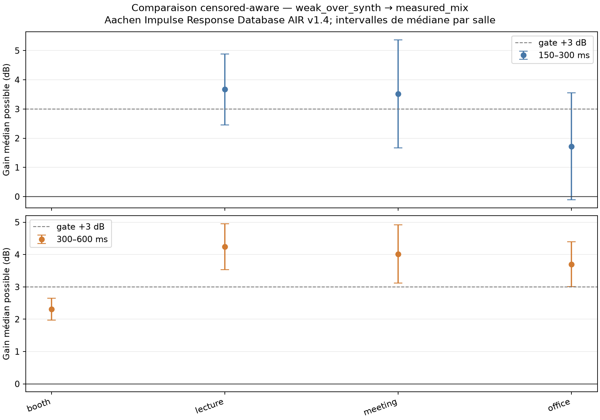

# Holdout externe de déréverbération : AIR v1.4

**Date :** 2026-10-09
**Statut :** transfert de domaine externe à BUT, checkpoints gelés; aucune comparaison Adobe.

## Question

Le candidat `measured-RIR-v1`, entraîné avec des RIR mesurées BUT et des RIR procédurales, améliore-t-il la réduction de queue par rapport au checkpoint weak-over synthétique sur une source indépendante de réponses mesurées ?

## Jeu de données et protocole

AIR v1.4 est fourni par RWTH Aachen. La page officielle décrit des réponses mesurées dans plusieurs environnements et indique que l’archive contient un `license.txt`; la copie téléchargée comprend aussi un `readme.txt` qui dit explicitement que la base est sous MIT. Archive : 193 Mo, SHA-256 `d2fd52767505c402e8aed9299dcd046493c8254cfab2f769fcf480dc7c616a5f`. [Page AIR de RWTH Aachen](https://www.iks.rwth-aachen.de/en/research/tools-downloads/databases/aachen-impulse-response-database).

La sélection déterministe porte sur les distances source-micro minimale et maximale dans quatre lieux (booth, office, meeting, lecture), soit huit RIR. Ce choix ne dépend d’aucun score de modèle. Chaque RIR est extraite du canal droit (`channel=0`) de la base binaurale; le `load_air.m` fourni dans l’archive définit `head=0` comme « no dummy head ». On l’a convertie en mono 16 kHz. Ce test fournit quatre lieux mesurés externes, mais le trajet binaural non mannequiné reste différent d’un microphone omnidirectionnel mono.

Le comparatif utilise 12 voix `train-clean-360` distinctes de celles employées lors des écrans BUT. Pour chaque voix, deux fichiers successifs sont assemblés avec une pause numérique contrôlée de 800 ms. Les checkpoints sont gelés : weak-over synthétique SHA-256 `31e0b7b01224103c58bd5e4453005ad5065a710f71a3d78106c0976662434a40`; candidat measured-mix SHA-256 `c49ccf72b4874c233548d14e74a02c6ac66b1f5f653762a18986e60499aa31b3`. Les deux ont 555 922 paramètres.

Les métriques conservent les fenêtres 150–300 et 300–600 ms après la fin de parole sèche, la référence fixe issue de l’entrée wet, le contrôle sec et le plancher commun `Cᵢ=max(F_Aᵢ,F_Bᵢ)+3 dB`. Les mesures sous le plancher sont traitées comme censurées, sans soustraction du bruit de fond ni suppression des lignes censurées.

## Résultats censor-aware

Un gain positif signifie que le candidat a une queue résiduelle plus faible que le weak-over synthétique.

| Fenêtre après la phrase | Paires exactes | Candidat au plancher | Référence au plancher | Deux planchers | Intervalle possible de médiane | Victoires garanties candidat >0 / >3 dB | Victoires garanties référence |
|---|---:|---:|---:|---:|---:|---:|---:|
| 150–300 ms | 61/96 | 15 | 2 | 18 | **[1,68; 4,73] dB** | 60 / 31 | 18 |
| 300–600 ms | 75/96 | 17 | 0 | 4 | **[2,92; 4,44] dB** | 91 / 45 | 1 |

Les quatre lieux n’ont pas un résultat uniforme dans la première fenêtre. Les intervalles possibles de médiane sont booth **[1,96; +∞]**, lecture **[2,45; 4,88]**, meeting **[1,67; 5,37]**, office **[−0,11; 3,55] dB**. La borne infinie pour booth vient des nombreuses lignes censurées; elle ne signifie pas une suppression infinie. En 300–600 ms, les intervalles par lieu sont booth [1,98; 2,65], lecture [3,53; 4,95], meeting [3,11; 4,92], office [3,00; 4,40] dB.

Le gain moyen apparié exact seul ne résume donc pas proprement l’expérience. L’intervalle de médiane possible confirme un avantage global mesurable dans les deux fenêtres, mais ne garantit ni +3 dB dans les deux fenêtres ni une amélioration robuste dans chaque lieu. Il s’agit d’un signal de transfert prometteur, plus modeste que le diagnostic sur les trois salles BUT mises à part.

| Gate préenregistré | Résultat |
|---|---|
| Borne basse de médiane >0 dB dans les deux fenêtres | Passe : +1,68 dB et +2,92 dB |
| Aucune médiane par lieu clairement négative | Non confirmé : l’intervalle 150–300 ms du bureau couvre −0,11 à +3,55 dB |
| Écart de contrôle sec ≤1 dB en activité et onset p10 | Passe de peu : −0,71 et −0,93 dB |
| Gain garanti ≥3 dB dans au moins une fenêtre | Échoue de peu : borne basse maximale = +2,92 dB |

### Préservation, coût, limites

Sur les contrôles secs, le candidat perd 0,71 dB d’activité supplémentaire et 0,93 dB au p10 d’onset par rapport au weak-over synthétique. Ces valeurs restent sous le garde-fou de 1 dB, près de sa limite. Les métriques de trames faibles sur entrée réverbérée contiennent encore les queues acoustiques et ne sont pas une mesure isolée de gain vocal.

Sur la GTX 1050 Ti, les modèles passent chacun environ 29,76 s de signal en 94 ms, RTF ≈0,0032. C’est un débit hors ligne, pas une mesure de latence d’une chaîne micro temps réel.

AIR contient ici quatre lieux et huit réponses; les 96 paires de chaque fenêtre sont corrélées par locuteur et RIR. Elles ne représentent pas 96 pièces indépendantes. Le test ne comprend pas de bruit ambiant, de mouvements, de microphone réel en direct, de mesure perceptive ou d’Adobe. La sélection porte sur une base binaurale avec canal droit, et le modèle reste évalué en mono.

## Décision

Garder `measured-RIR-v1` gelé comme candidat expérimental. L’adaptation BUT semble transférer une partie de son effet aux RIR AIR externes, en particulier dans la fenêtre tardive, sans dégradation sèche supérieure à environ 1 dB. Elle ne passe pas un critère strict de +3 dB garanti dans les deux fenêtres, et l’intervalle de la fenêtre 150–300 ms reste compatible avec un résultat légèrement négatif dans le lieu office.

Ne pas réentraîner sur AIR à partir de ce seul écran : les résultats servent d’abord à tester la transférabilité et à planifier un holdout supplémentaire indépendant, notamment dEchorate avec sélection par configuration de parois et proximité source-micro. Aucune équivalence Adobe ni généralisation universelle n’est établie.

## Artefacts

- [Plan préenregistré et gates](../superpowers/plans/2026-10-09-air-external-rir-holdout.md).
- Résultats détaillés, cas, manifeste et checkpoint SHA : `.tools/compact-dereverb/air-external-2026-10-09/` (local, ignoré par Git).
- [JSON censor-aware](assets/air-external-2026-10-09/censor-aware-paired-comparison.json) et [résumé du benchmark](assets/air-external-2026-10-09/summary.json).
- Extraction : [`extract_air_rirs.py`](../../scripts/benchmarks/universal_enhancer/compact_dereverb/extract_air_rirs.py); runner et analyse : [`screen_measured_rirs.py`](../../scripts/benchmarks/universal_enhancer/compact_dereverb/screen_measured_rirs.py), [`analyze_censored_pairs.py`](../../scripts/benchmarks/universal_enhancer/compact_dereverb/analyze_censored_pairs.py).
