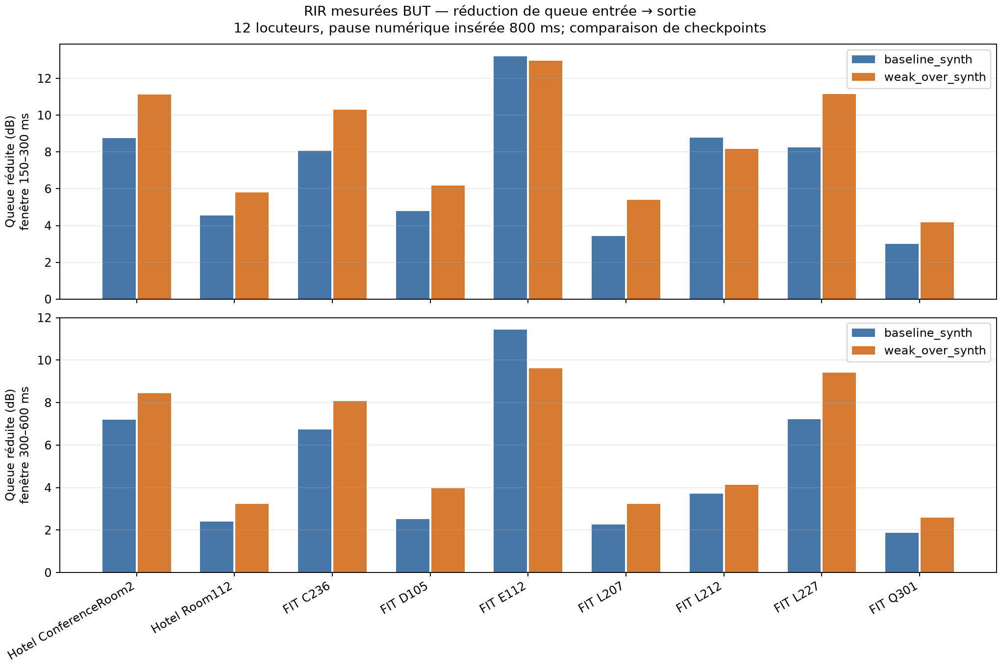
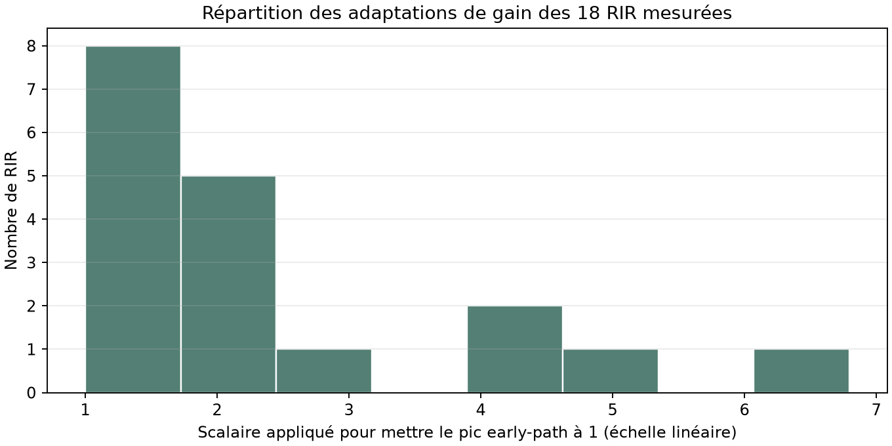
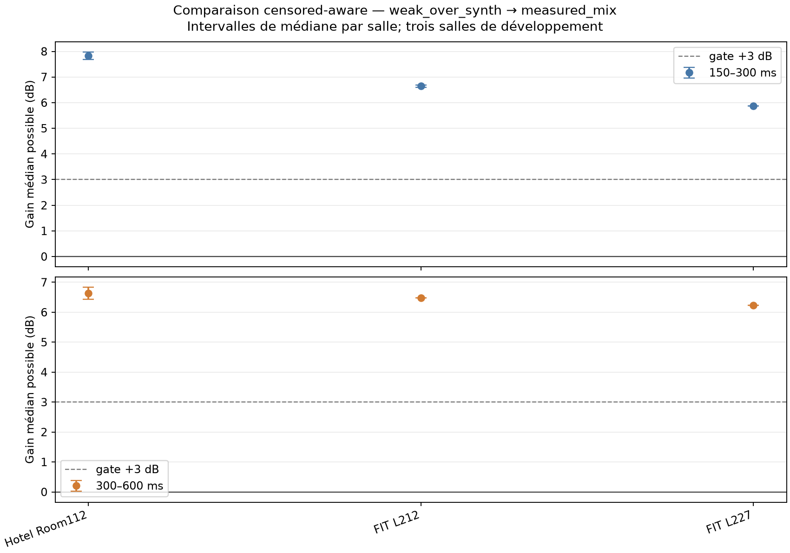

# Déréverbération : holdout BUT ReverbDB mesuré

**Date :** 2026-10-09
**Statut :** diagnostic de transfert hors domaine, pas une validation de produit ni une comparaison Adobe.

## Question

Les checkpoints compacts entraînés sur RIR procédurales réduisent-ils une queue de réverbération mesurée, et le checkpoint weak-over améliore-t-il le compromis par rapport au baseline ? Les deux checkpoints sont gelés pendant ce test.

## Données et protocole

- **Voix propre :** LibriSpeech `train-clean-360`, CC BY 4.0, 12 locuteurs sans chevauchement avec les splits déjà utilisés. Pour chaque locuteur, deux énoncés adjacents complets sont assemblés avec 800 ms de silence numérique. C’est une pause contrôlée insérée, pas une pause naturelle.
- **RIR :** paquet RIR-only BUT Speech@FIT ReverbDB, neuf salles, deux configurations source/micro sélectionnées par salle avant l’inférence (distance minimale et maximale). Un seul canal physique est utilisé, à 16 kHz, et la convolution complète conserve toute la queue.
- **Échelle :** le pic early-path dans les 10 ms après l’onset est ramené à 1 pour reproduire la convention des RIR synthétiques d’entraînement. Cette normalisation d’amplitude de domaine n’est pas une calibration SPL; le facteur appliqué aux 18 RIR va de 1,00 à 6,79 (médiane 1,85).
- **Queue :** le point de fin de phrase est dérivé du signal sec. Les fenêtres 50–150, 150–300 et 300–600 ms sont mesurées après cette fin, avec 200 ms de garde avant la phrase suivante. La référence est l’énergie de parole de la phrase 1 dans l’entrée réverbérée, sur un masque actif construit à partir du sec; input et output partagent cette référence.
- **Plancher :** chaque modèle reçoit aussi la version sèche du même signal. Le plancher sec est enregistré relativement à la parole sèche et converti vers la même référence fixe de parole wet utilisée pour la queue. Aucun plancher n’est soustrait. Pour comparer deux modèles, le seuil commun est `max(plancher_A, plancher_B) + 3 dB`; les mesures sous ce seuil deviennent des intervalles censurés.
- **Échelle du test :** 12 locuteurs × 18 RIR = 216 cas réverbérés par modèle, plus les contrôles secs appariés. Les observations corrélées sont agrégées par locuteur × salle; elles ne sont pas présentées comme 216 voix indépendantes.

Les RIR viennent de [BUT Speech@FIT Reverb Database](https://speech.fit.vut.cz/software/but-speech-fit-reverb-database) et de son [README de structure et métadonnées](https://merlin.fit.vutbr.cz/ReverbDB/read_me.txt). LibriSpeech et sa licence sont décrits par [OpenSLR SLR12](https://www.openslr.org/12/). Les fichiers audio et rendus restent sous `.tools/` et ne sont pas inclus dans le dépôt.

## Résultats

La réduction entrée→sortie est calculée seulement lorsque la sortie est au-dessus du plancher. Les comptes censurés sont rapportés à part, car comparer les médianes non censurées seules crée un biais de sélection.

| Fenêtre après la phrase | Baseline : réduction médiane (non censurées) | Weak-over : réduction médiane (non censurées) | Gain weak-over, borne possible de la médiane | Statut des 216 comparaisons au plancher commun |
|---|---:|---:|---:|---:|
| 50–150 ms | 9,21 dB (214/216) | 12,32 dB (211/216) | — | — |
| 150–300 ms | 7,78 dB (214/216) | 8,78 dB (212/216) | **[1,15; 1,21] dB** | 212 exactes, 2 des deux au plancher, 2 weak-over au plancher |
| 300–600 ms | 4,86 dB (216/216) | 5,71 dB (216/216) | **0,61 dB** | 216 exactes |

La réduction médiane du weak-over est modeste sur les neuf salles (1,15 dB en 150–300 ms et 0,61 dB en 300–600 ms selon les mesures exactes). Le gate de +3 dB n’est pas atteint. Les différences par salle sont hétérogènes; en particulier E112 et L212 ont des médianes négatives face au baseline dans les deux fenêtres principales. Les intervalles ci-dessus incluent les mesures censurées et sont descriptifs sur les 216 paires corrélées, pas des intervalles de confiance.

Les résultats de parole sur une entrée réverbérée ne doivent pas être interprétés comme un gain vocal pur : les cadres peuvent contenir simultanément la voix actuelle et les queues des phonèmes précédents. Sur les contrôles secs, le changement actif médian vaut −0,51 dB pour le baseline et −0,93 dB pour weak-over; leur p10 d’onset est −0,93 dB et −1,10 dB. Ces contrôles indiquent une atténuation modérée du modèle, mais ne permettent pas d’isoler la préservation vocale sur une pièce réverbérante.

## Coût et matériel

Les deux modèles ont 555 922 paramètres. Sur la GTX 1050 Ti, l’inférence médiane est d’environ 94 ms pour un signal d’entrée complet médian de 30,35 s, soit un RTF médian proche de 0,00311. Cela mesure le débit hors ligne sur ces fichiers et ne mesure pas la latence d’un moteur temps réel.

## Décision

Le critère préenregistré de progrès d’au moins 3 dB dans les deux fenêtres n’est pas satisfait par le weak-over face au baseline. L’écart entre entraînement synthétique et RIR mesurées reste une hypothèse utile, à vérifier par adaptation de domaine.

La mesure `output/clean` sur les entrées réverbérées peut dépasser largement 0 dB parce qu’elle confond la parole et l’énergie de la pièce. Elle est désormais décrite comme énergie excédentaire de trames faibles par rapport au clean, et non comme gain de voix.

## Prochain essai : une seule variable

GPT Web recommande un A/B de domaine RIR, sans changement d’architecture : entraîner un modèle neuf avec la même architecture, les mêmes voix `train-clean-100`, la même loss weak-over, le même optimiseur, la même graine et 3 000 updates, mais 50 % de RIR procédurales et 50 % de RIR BUT mesurées. Tirer d’abord une salle uniformément parmi six salles d’entraînement, puis une RIR uniformément dans cette salle. Garder trois salles entières hors entraînement et hors sélection du checkpoint.

Pour sélectionner le checkpoint, employer `dev-clean`, les RIR procédurales et une configuration source/micro distincte par salle parmi les six salles d’entraînement. Une fois le checkpoint fixé, évaluer ces trois salles non vues sur le même protocole et les mêmes métriques, contre le checkpoint weak-over synthétique gelé. Les neuf salles de BUT ayant déjà été inspectées, le split sert au diagnostic de généralisation cross-room, pas à une validation externe finale.

Gates de diagnostic suggérés par GPT Web : au moins +3 dB médian supplémentaire sur les queues des salles non vues, amélioration de même signe dans les trois salles, contrôles secs à environ ±1 dB, onset et parole active sans dégradation de plus de 1 dB par rapport au weak-over, et aucun accroissement du plancher. Ne pas ajouter d’EQ, de nouvelle loss de coloration, de nouvelle loss d’onset ou de nouvelle cible early-RIR à cette passe : ces changements empêcheraient d’attribuer l’effet au changement de RIR.

## Résultat de l’adaptation de domaine BUT

Le modèle mesuré-mix a été entraîné depuis une initialisation déterministe fraîche pendant 3 000 updates sur la GTX 1050 Ti (environ 133 s), avec 50 % de RIR procédurales et 50 % de RIR BUT tirées uniformément par salle parmi six salles. Architecture, données vocales, objectif weak-over, optimiseur et budget sont restés identiques. Pour la sélection du checkpoint, les RIR de validation sont des configurations source/micro distinctes des RIR de train dans ces six salles. Les trois salles restantes n’ont servi ni à l’entraînement ni à la sélection.

L’analyse censor-aware emploie un plancher commun par paire `Cᵢ = max(F_Aᵢ, F_Bᵢ) + 3 dB`, référencé à la même énergie d’entrée wet. Chaque amélioration est une valeur exacte ou une borne, jamais une valeur inventée sous le plancher.

| Fenêtre | Statut sur 72 paires speaker × RIR | Borne de médiane possible du gain mesuré-mix vs weak-over synth | Paires avec gain garanti >0 / >3 dB | Médianes possibles par salle |
|---|---|---:|---:|---|
| 150–300 ms | 69 exactes, 3 candidate au plancher | **[6,79; 6,95] dB** | 71 / 67 | +7,68 à +7,97; +6,60 à +6,69; +5,87 dB |
| 300–600 ms | 71 exactes, 1 paire aux deux planchers | **[6,29; 6,38] dB** | 71 / 66 | +6,44 à +6,83; +6,48; +6,23 dB |

Les trois salles ont le même signe d’amélioration. Le contrôle sec perd 0,44 dB d’activité et 0,69 dB sur le p10 d’onset par rapport au weak-over synthétique, donc reste dans le garde-fou de 1 dB fixé avant l’essai. Les deux modèles ont toujours 555 922 paramètres et traitent environ 30 s d’entrée en 94 ms sur la GTX 1050 Ti (RTF ≈0,0032). Les 72 paires sont corrélées par locuteur, RIR et salle; seules trois salles structurent ici la généralisation. Les résultats par salle sont descriptifs et aucune p-value naïve sur 72 lignes n’est utilisée.

Le graphe montre les médianes possibles par salle, avec l’incertitude due aux sorties censurées. Le seuil pointillé est le gate de +3 dB.

Ce résultat soutient un signal descriptif d’adaptation au domaine mesuré sur trois salles BUT tenues à part, sans dégradation notable des contrôles secs. Il ne démontre pas une généralisation à toutes les pièces ou une parité avec Adobe. Ces trois salles avaient déjà été observées dans l’expérience précédente à neuf salles. Un test externe a depuis été effectué sur AIR v1.4; voir le [rapport AIR](air-external-rir-holdout-2026-10-09.md). Il est positif dans l’ensemble, mais n’atteint pas +3 dB garanti dans les deux fenêtres.

## Artefacts et reproduction

- Détail complet des critères et de l’état : [`plan BUT mesuré`](../superpowers/plans/2026-10-09-but-measured-rir-holdout.md).
- Résumé machine, par salle et chaque cas : `.tools/compact-dereverb/measured-rir-holdout-unit-peak/` (local, ignoré par Git).
- Comparaison censored-aware du modèle mixte sur les salles non vues : [`censor-aware-paired-comparison.json`](assets/measured-mix-cross-room-2026-10-09/censor-aware-paired-comparison.json).
- Analyse censored-aware de baseline vs weak-over sur neuf salles : [`censor-aware-paired-comparison.json`](assets/measured-rir-corrected/censor-aware-paired-comparison.json).
- Graphe censored-aware de baseline vs weak-over sur neuf salles : [`censor-aware-paired-comparison.png`](assets/measured-rir-corrected/censor-aware-paired-comparison.png).
- Checkpoints gelés et leurs SHA-256 : dans `summary.json` sous `.tools/compact-dereverb/measured-rir-holdout-unit-peak/summary.json`.
- Runner : [`screen_measured_rirs.py`](../../scripts/benchmarks/universal_enhancer/compact_dereverb/screen_measured_rirs.py); résumé/graphes : [`summarize_measured_rirs.py`](../../scripts/benchmarks/universal_enhancer/compact_dereverb/summarize_measured_rirs.py).
- Résultats externes sur AIR v1.4 : [rapport, bornes censurées, graphe et protocole](air-external-rir-holdout-2026-10-09.md).
