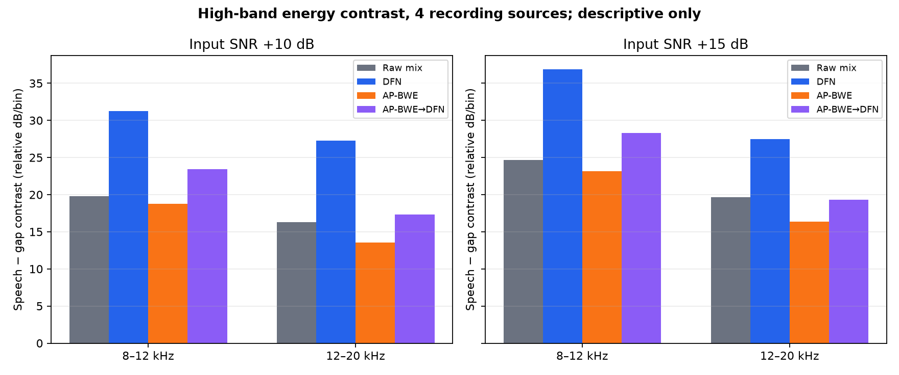

# Controlled noise v1: 11 voices, 4 recording sources

This is a descriptive, reproducible local benchmark of DeepFilterNet 0.5.6 and the experimental AP-BWE → DeepFilterNet chain. It evaluates controlled classroom-noise mixtures against their known audiobook speech stems. It does not establish studio quality or universal performance.

## Corpus and protocol

- 11 French audiobook readers, 30 seconds each, from four recording works. Eight readers belong to *Légendes rustiques*; readers are aggregated within each work before giving the four works equal weight.
- Original sources are mono, mostly 44.1 kHz MP3 at 128 kbps. They are not clean studio masters or true wideband references.
- One public-domain classroom ambience recording is mixed at measured active-speech SNR +5, +10 and +15 dB. The speech stem is scaled by −6 dB before mixing; no normalization or limiting is applied.
- DeepFilterNet uses its default attenuation limit (100 dB). AP-BWE uses the pinned local 16→48 kHz model; its output is passed to DeepFilterNet.
- Source-balanced results are the median across readers within each work, then the median of the work-level values. The main 11-reader batch contains exactly four recording works.
- Voice/noise projection metrics are controlled-signal proxies. AP-BWE-generated frequencies above 8 kHz cannot be scored as accurate against these band-limited MP3 references.

## Main results

| Pipeline | Input SNR | SNR gain | Active SI-SDR | Projected voice gain | CPU RTF |
|---|---:|---:|---:|---:|---:|
| DeepFilterNet | +5 dB | +5.04 dB | 10.03 dB | −0.57 dB | 0.273 |
| DeepFilterNet | +10 dB | +3.81 dB | 13.81 dB | −0.38 dB | 0.284 |
| DeepFilterNet | +15 dB | +2.36 dB | 17.34 dB | −0.29 dB | 0.275 |
| AP-BWE → DeepFilterNet | +5 dB | +4.28 dB | 9.29 dB | −1.05 dB | 0.706 |
| AP-BWE → DeepFilterNet | +10 dB | +2.42 dB | 12.42 dB | −1.03 dB | 0.704 |
| AP-BWE → DeepFilterNet | +15 dB | −0.42 dB | 14.57 dB | −1.09 dB | 0.706 |

The table above is the initial full-band projection score. Its residual term also counts generated >8 kHz AP-BWE energy as error against the band-limited MP3 reference, so it is not the primary denoising comparison. The band-limited re-score below isolates the known 0–7.9 kHz region.

| Pipeline | Input SNR | SNR gain below 8 kHz | Active SI-SDR below 8 kHz | Projected voice gain below 8 kHz |
|---|---:|---:|---:|---:|
| DeepFilterNet | +5 dB | +5.04 dB | 9.95 dB | −0.57 dB |
| DeepFilterNet | +10 dB | +3.82 dB | 13.75 dB | −0.38 dB |
| DeepFilterNet | +15 dB | +2.38 dB | 17.30 dB | −0.29 dB |
| AP-BWE → DeepFilterNet | +5 dB | +4.49 dB | 9.49 dB | −1.01 dB |
| AP-BWE → DeepFilterNet | +10 dB | +2.92 dB | 12.94 dB | −0.99 dB |
| AP-BWE → DeepFilterNet | +15 dB | +0.80 dB | 15.75 dB | −1.05 dB |

DFN alone remains more faithful to the known stem and produces more in-band SNR gain at each SNR in this set. The gap in active SI-SDR grows from about 0.5 dB at +5 dB input to 1.6 dB at +15 dB. AP-BWE → DFN is around 2.5× slower. Keep AP-BWE optional pending the user's listening and true-wideband validation.

## AP-BWE order and sample-rate audit

The first order ablation accidentally represented only three works because Christiane and Rémi both come from *Légendes rustiques*. A fourth reader, Naf from *Lettres de mon moulin*, was added; the figures below use one reader from each of the four works. At +5 dB, DFN alone gains +7.37 dB SNR below 8 kHz versus +4.58 dB for AP-BWE → DFN (100 dB limit). At +15 dB, DFN alone gains +4.31 dB, versus +1.00 dB for AP-BWE → DFN. The corrected four-work results no longer support the earlier three-work summary.

The 48→16→48 kHz conversion is the expected AP-BWE operating path, not itself an integration error. To check whether mixing before downsampling was the problem, two paths were compared: (A) downsample the 48 kHz mixture and (B) downsample voice and noise separately, then remix at the same measured 16 kHz SNR. Their SNR and 0–8 kHz SI-SDR results were nearly identical (under 0.2 dB difference across the four sources and +10/+15 dB cases). This refutes a material ordering effect from that resampling step in this limited sample.

A supplementary active SI-SDR check on AP-BWE clean round trips returned 29.3–33.1 dB for the four representatives. A resampling-only branch returned 25.1–49.6 dB, which varies widely by source; it is not a reliable universal “ceiling.” Both branches start from the same 16 kHz source array, use the same torchaudio 16→48 resampler, the same final FFmpeg 48→16 resampler, same active mask, and report zero lag. The variation still makes these values illustrative rather than an absolute AP-BWE quality score; SI-SDR is scale-invariant and does not capture the projected voice-gain change.

The full-band projection penalty therefore combines changes to known 0–8 kHz content and generated >8 kHz content that the MP3 reference cannot verify. Report those bands separately; do not call generated high frequencies correct or incorrect without a wideband reference.

## Descriptive high-band energy

The following STFT dB/bin measurements use a source-only speech mask with a ±120 ms guard. Speech-energy medians use all four readers (one per work) at +10/+15 dB. Gap-energy and speech/gap contrast medians use three works: the Emy excerpt contains no detected gap frames after the mask guard. These are relative spectral descriptors; there is no true high-band reference in the MP3 sources.

| Input SNR | Band | Candidate | Speech energy | Gap energy | Speech − gap contrast |
|---:|---:|---|---:|---:|---:|
| +10 dB | 8–12 kHz | Raw mix | −76.17 | −98.91 | 19.81 |
| +10 dB | 8–12 kHz | DFN | −76.62 | −107.83 | 31.27 |
| +10 dB | 8–12 kHz | AP-BWE | −78.02 | −96.15 | 18.75 |
| +10 dB | 8–12 kHz | AP-BWE → DFN | −78.55 | −98.98 | 23.42 |
| +10 dB | 12–20 kHz | Raw mix | −90.98 | −107.35 | 16.28 |
| +10 dB | 12–20 kHz | DFN | −91.58 | −119.71 | 27.25 |
| +10 dB | 12–20 kHz | AP-BWE | −84.24 | −97.90 | 13.56 |
| +10 dB | 12–20 kHz | AP-BWE → DFN | −84.99 | −100.08 | 17.35 |
| +15 dB | 8–12 kHz | Raw mix | −76.19 | −103.77 | 24.69 |
| +15 dB | 8–12 kHz | DFN | −76.61 | −113.30 | 36.86 |
| +15 dB | 8–12 kHz | AP-BWE | −78.14 | −101.20 | 23.14 |
| +15 dB | 8–12 kHz | AP-BWE → DFN | −78.61 | −103.41 | 28.28 |
| +15 dB | 12–20 kHz | Raw mix | −91.03 | −111.15 | 19.65 |
| +15 dB | 12–20 kHz | DFN | −91.50 | −120.65 | 27.48 |
| +15 dB | 12–20 kHz | AP-BWE | −84.57 | −101.82 | 16.34 |
| +15 dB | 12–20 kHz | AP-BWE → DFN | −85.18 | −103.23 | 19.30 |

AP-BWE raises 12–20 kHz energy during both speech and gaps. At +10 dB, the active band rises about 6.7 dB and gap energy about 9.4 dB relative to the raw mix, so the speech/gap contrast drops. DFN alone produces the lowest gap floor and strongest speech/gap contrast. AP-BWE → DFN restores some contrast over AP-BWE alone, but remains below DFN in these descriptive measurements.

## Interpretation and next gates

- This corpus measures robustness across French audiobook voices, not across microphones, rooms, calls, streaming, music, overlapping speakers or languages.
- There is one classroom-noise recording and no naturally noisy recording set. Repeat with other noise types before choosing a universal denoiser.
- The initial order ablation represented three works because two readers came from the same title. It was superseded after adding Naf; the corrected results include four independent works.
- Do not optimize toward Adobe’s spectrum. Adobe remains a perceptual external reference; known clean stems are the objective benchmark reference.
- Keep AP-BWE as a separately selectable bandwidth-restoration stage for now. Do not describe it as denoising, echo cancellation or dereverberation.
- Before making AP-BWE a default stage, require acceptable user listening, no substantial loss below 8 kHz, speech-correlated high-band output on clean wideband references, and no strong source-specific regression.
- Next: test DeepFilterNet attenuation 18/40/100 dB across multiple noise types and SNRs, run controlled echo/reverb against dry references, then evaluate one restoration challenger only after confirming code/weight licenses and local download/runtime constraints.

The underlying corpus audio, models, full metrics and listening renders remain local and are not included in the repository. The PNG figures above are summary plots only.
