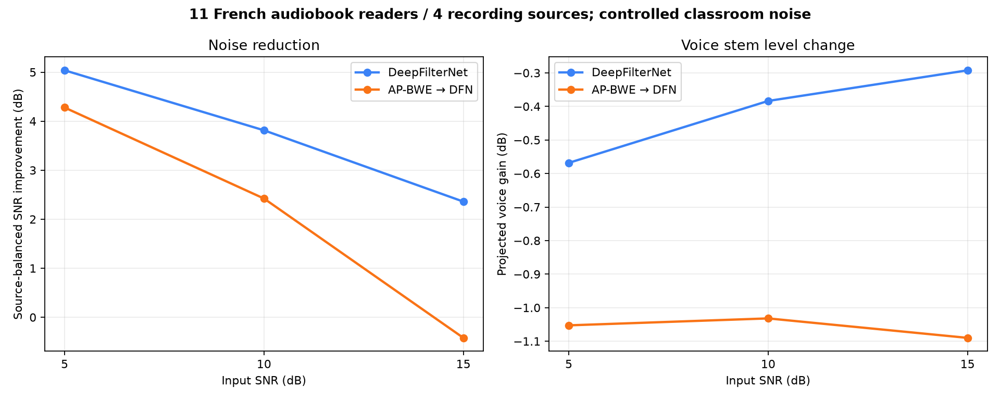
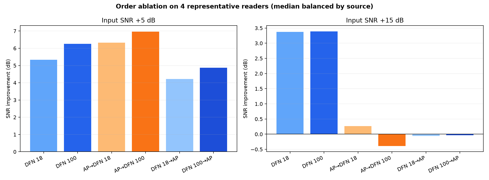
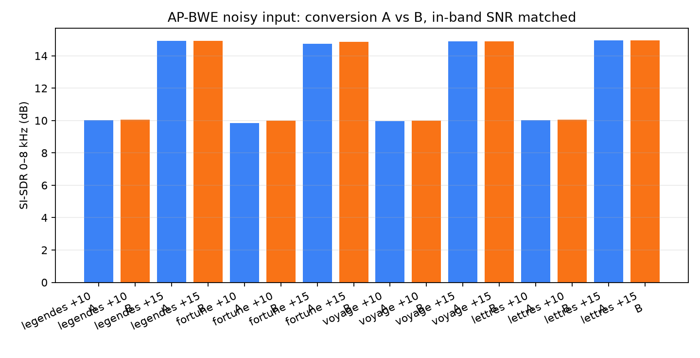

# Controlled noise v1: 11 voices, 4 recording sources

This is a descriptive, reproducible local benchmark of DeepFilterNet 0.5.6 and the experimental AP-BWE → DeepFilterNet chain. It evaluates controlled classroom-noise mixtures against their known audiobook speech stems. It does not establish studio quality or universal performance.

## Corpus and protocol

- 11 French audiobook readers, 30 seconds each, from four recording works. Eight readers belong to *Légendes rustiques*; readers are aggregated within each work before giving the four works equal weight.
- Original sources are mono, mostly 44.1 kHz MP3 at 128 kbps. They are not clean studio masters or true wideband references.
- One public-domain classroom ambience recording is mixed at measured active-speech SNR +5, +10 and +15 dB. The speech stem is scaled by −6 dB before mixing; no normalization or limiting is applied.
- DeepFilterNet uses its default attenuation limit (100 dB). AP-BWE uses the pinned local 16→48 kHz model; its output is passed to DeepFilterNet.
- Source-balanced results are the median across readers within each work, then the median of the work-level values.
- Voice/noise projection metrics are controlled-signal proxies. AP-BWE-generated frequencies above 8 kHz cannot be scored as accurate against these band-limited MP3 references.

## Main results

| Pipeline | Input SNR | SNR gain | Active SI-SDR | Projected voice gain | CPU RTF |
|---|---:|---:|---:|---:|---:|
| DeepFilterNet | +5 dB | +5.04 dB | 10.03 dB | −0.57 dB | 0.273 |
| DeepFilterNet | +10 dB | +3.81 dB | 13.81 dB | −0.38 dB | 0.284 |
| DeepFilterNet | +15 dB | +2.36 dB | 17.34 dB | −0.29 dB | 0.275 |
| AP-BWE → DeepFilterNet | +5 dB | +4.28 dB | 9.29 dB | −1.05 dB | 0.706 |
| AP-BWE → DeepFilterNet | +10 dB | +2.42 dB | 12.42 dB | −1.03 dB | 0.704 |
| AP-BWE → DeepFilterNet | +15 dB | −0.42 dB | 14.57 dB | −1.09 dB | 0.706 |

DeepFilterNet alone has better fidelity to the known stem at all three SNRs and is about 2.5× faster in this CPU run. AP-BWE → DFN attenuates the projected speech stem about 1 dB. At +15 dB input SNR, its median output SNR is slightly worse than the input. These measurements support keeping AP-BWE optional while listening and checking its high-frequency contribution on true wideband references.

## AP-BWE order and sample-rate audit

A short order ablation used one reader from each of four works at +5 and +15 dB. At +5 dB, AP-BWE → DFN (100 dB limit) gives +6.97 dB median SNR gain, versus +6.25 dB for DFN alone; it also reduces the projected speech stem more. At +15 dB, AP-BWE → DFN gives −0.39 dB, and DFN → AP-BWE gives approximately −0.03 dB, versus +3.39 dB for DFN alone.

The 48→16→48 kHz conversion is the expected AP-BWE operating path, not itself an integration error. To check whether mixing before downsampling was the problem, two paths were compared: (A) downsample the 48 kHz mixture and (B) downsample voice and noise separately, then remix at the same measured 16 kHz SNR. Their SNR and 0–8 kHz SI-SDR results were nearly identical (under 0.2 dB difference across the four sources and +10/+15 dB cases). This refutes a material ordering effect from that resampling step in this limited sample.

On clean inputs, AP-BWE-only active SI-SDR in 0–8 kHz was 28.8–32.8 dB for the four representatives. This indicates that the existing narrowband content was mostly retained by the wrapper. The full-band penalty in the main benchmark therefore mixes two effects: changes to known 0–8 kHz content and generated >8 kHz content that the MP3 reference cannot verify. Report those bands separately; do not call generated high frequencies correct or incorrect without a wideband reference.

## Interpretation and next gates

- This corpus measures robustness across French audiobook voices, not across microphones, rooms, calls, streaming, music, overlapping speakers or languages.
- There is one classroom-noise recording and no naturally noisy recording set. Repeat with other noise types before choosing a universal denoiser.
- Do not optimize toward Adobe’s spectrum. Adobe remains a perceptual external reference; known clean stems are the objective benchmark reference.
- Keep AP-BWE as a separately selectable bandwidth-restoration stage for now. Do not describe it as denoising, echo cancellation or dereverberation.
- Before making AP-BWE a default stage, require acceptable user listening, no substantial loss below 8 kHz, speech-correlated high-band output on clean wideband references, and no strong source-specific regression.
- Next: test DeepFilterNet attenuation 18/40/100 dB across multiple noise types and SNRs, run controlled echo/reverb against dry references, then evaluate one restoration challenger only after confirming code/weight licenses and local download/runtime constraints.

The underlying corpus audio, models, full metrics and listening renders remain local and are not included in the repository. The PNG figures above are summary plots only.
