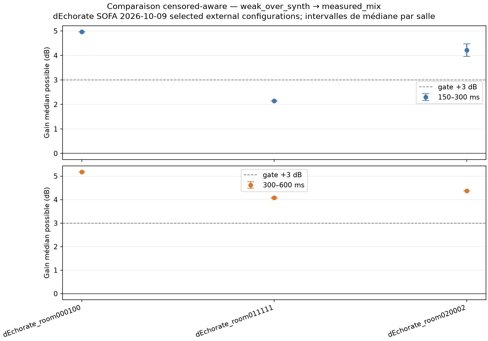

# dEchorate external frozen holdout — 2026-10-09

## Question

Does the frozen measured-RIR adaptation transfer beyond BUT and AIR to measured responses from dEchorate? This is a dereverberation transfer test; it does not measure noise reduction, echo cancellation in a duplex call, or perceptual parity with Adobe Podcast.

## Protocol and data provenance

- Source: [official dEchorate SOFA index](https://sofacoustics.org/data/database/dechorate/) and official room/source/microphone annotation file.
- Each selected SOFA embeds the MIT license text in its `License` attribute. We verify this for every probe and selected SOFA. Original files are 48 kHz; the selected receiver response and `Data.Delay` are preserved, then the shared benchmark converts to mono 16 kHz and applies its fixed training-domain early-path normalization. This scale is not SPL calibration.
- One `source1 / array1` probe per each of the 11 configuration codes was used only to rank configurations by the median T20 across five receivers. T20 is broadband Schroeder decay with a linear fit from −5 to −25 dB, extrapolated to 60 dB. Minimum / median / maximum selections were `room000100` (0.1569 s), `room020002` (0.2187 s), `room011111` (0.5916 s). The probe RIRs were excluded from scoring.
- In each selected configuration, geometrical extremes were selected across all indexed source/array paths except `source1 / array1`, using official 3D coordinates and deterministic source → array → microphone tie-breaks. Near: source 9 / array 1 / mic 1, 0.898 m. Far: source 4 / array 2 / mic 10, 4.258 m. These selections and file hashes are in the local run manifest.
- Near/far also changes source ID and array. Treat this split as descriptive; it does not isolate distance or direct-to-reverberant ratio as a causal factor. The model A/B comparison remains paired on each fixed RIR.
- 12 train-clean-360 speakers were selected after excluding all 24 speakers from prior BUT and AIR holdouts. For each, the same two successive utterance files and an inserted 800 ms digital pause were used for both models.
- A: synth-only weak-over checkpoint `31e0b7b01224103c58bd5e4453005ad5065a710f71a3d78106c0976662434a40`. B: measured-mix checkpoint `c49ccf72b4874c233548d14e74a02c6ac66b1f5f653762a18986e60499aa31b3`. Both are 555,922 parameters and remained frozen. No dEchorate tuning or output gain matching was applied.
- 72 paired speaker × RIR observations per window; these are repeated observations over only three configurations of one reconfigured room. No naive p-values or claim of three independent buildings.

## Censor-aware result

For each pair, the shared measurement floor is `Cᵢ = max(F_Aᵢ, F_Bᵢ) + 3 dB`; lower tail level is better. Values under the floor stay censored intervals. The headline is the possible median interval over all 72 pairs, not a median that drops censored cases.

| Tail window | Possible median gain B vs A | B guaranteed better >0 dB | B guaranteed better >3 dB | A guaranteed better | B at floor |
|---|---:|---:|---:|---:|---:|
| 150–300 ms | **[3.10, 3.58] dB** | 65 / 72 | 37 / 72 | 7 / 72 | 7 / 72 |
| 300–600 ms | **[4.28, 4.35] dB** | 70 / 72 | 48 / 72 | 2 / 72 | 4 / 72 |

All three configuration-specific median intervals are positive:

| Configuration | T20 rank | 150–300 ms | 300–600 ms |
|---|---:|---:|---:|
| `room000100` | minimum | [4.96, 4.96] dB | [5.17, 5.17] dB |
| `room020002` | median | [3.96, 4.48] dB | [4.37, 4.37] dB |
| `room011111` | maximum | [2.15, 2.15] dB | [4.05, 4.11] dB |

Near/far descriptive intervals show a larger gain on the selected near paths: 150–300 ms, near [6.78, 7.59] vs far 2.04 dB; 300–600 ms, near [6.39, 6.72] vs far 2.76 dB. Because source and array differ too, do not attribute this gap to distance alone.

The dry controls preserve active level within −0.31 dB and onset p10 within −0.73 dB for B versus A. The candidate reaches the common floor more often, but the small dry-control differences argue against explaining the entire tail result as broad attenuation. The measured-mix checkpoint’s absolute dry onset p10 is −1.49 dB relative to clean, so onset preservation remains a visible tradeoff to monitor.

## Runtime and plots

Inference ran locally on an NVIDIA GeForce GTX 1050 Ti. Median model forward time was 80.5 ms (A) and 77.8 ms (B) for a 23.815 s input, RTF 0.00332 and 0.00326 respectively. This is model-forward timing, not end-to-end live-device latency.

The structured results and per-configuration / near-far counts are in [`censor-aware.json`](assets/dechorate-external-2026-10-09/censor-aware.json); the selected-source hashes, geometry and embedded license evidence are in [`rir-selection-manifest.json`](assets/dechorate-external-2026-10-09/rir-selection-manifest.json). The complete run record is local at `.tools/compact-dereverb/dechorate-external-final-2026-10-09/manifest.json` and `cases.jsonl`. Dataset samples and generated audio stay local.

## Interpretation and limits

This is a strong positive transfer signal: the lower bound of the median improvement exceeds 3 dB in the early tail and 4 dB in the late tail, with all three selected configurations positive and dry active/onset deltas inside the predeclared 1 dB guard. It supports freezing `measured-RIR-v1` as a dereverberation candidate.

It does not show universal room transfer, full studio restoration, Adobe parity, or live microphone performance. dEchorate’s selected configurations are one physical room reconfigured; the six RIRs are not six independent rooms. The holdout was selected using a predeclared acoustic screen, and all inference used synthetic convolution without microphone noise or nonlinear capture.

### Run integrity note

An initial exploratory pass used a directory that still contained six older probe-derived WAVs. Its output was discarded. The reported pass used a fresh extraction directory; a pre-run check confirmed exactly six WAVs, all source/array combinations excluded from the classification probes, and MIT metadata present in all selected source files.

## Next step

Keep both checkpoints frozen. Before changing the model again, seek an independent multi-room holdout with measured RIR rights verified at the file level; report the dEchorate and AIR results side by side. A future experiment may add that corpus to training only after it has served as a sealed evaluation. For the live product, separately measure full streaming latency and onset behavior; these offline convolution results do not establish them.
