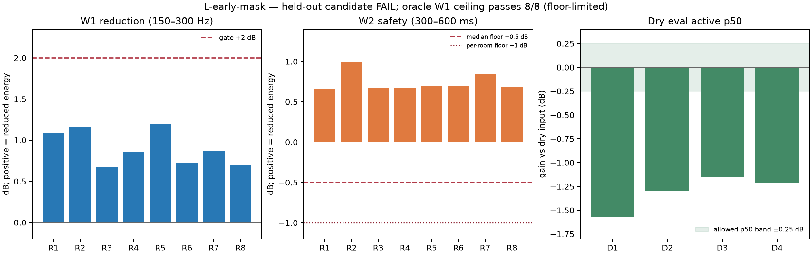

# L-early-mask synthetic preflight (2026-10-10)

## Decision

**NO-GO for this frozen mask learner.** The synthetic oracle ceiling says an early-only magnitude mask can suppress the generated late tail, but the trained model does not transfer that mask well enough to held-out rooms and substantially attenuates held-out dry voices. The result shows the loss/model combination is inadequate; it is not an Adobe-quality result.

## Frozen protocol

- 12 synthetic TRAIN RIRs and 8 entirely new EVAL RIRs, each split into direct/early (<50 ms) and late (>=50 ms) parts. Separate 4 dry TRAIN and 4 disjoint dry EVAL voices. No voice or RIR is shared across splits.
- 16 kHz, 512 FFT, 128 hop centered Hann. The same scalar is applied to full and early-only convolutions of a source.
- Oracle target: `m* = clip(|STFT(early)| / (|STFT(full)| + eps), 0, 1)`. Dry identity target is 1.
- Small gain-only mask network with temporal dilations [1,2,4,8], receptive field 31 frames (248 ms), mask `1 − 0.75 sigmoid(a)`, head initialized at `a=-3`. No phase, confidence, or waveform residual head.
- 1,000 deterministic AdamW steps (`lr=2e-4`, `weight_decay=1e-4`, clip 3) over 12 RIR and 4 dry items. Energy-weighted SmoothL1 mask loss; no W1 energy hinge.
- Before fitting, oracle gate: W1 median >=3 dB and at least 7/8 positive. Candidate gates: W1 median >=2 dB and >=7/8 positive; W2 median >=−0.5 dB and no room <−1 dB; held-out dry speech preservation thresholds; exact zero 100/100; finite values; repeated deterministic receipt.

## Results

The oracle passes the W1 gate 8/8. Its computed median W1 is **184.78 dB**, which is a numerical-floor result: in these synthetic clips, the early-only convolution has effectively no energy in the post-pause window. Treat this only as evidence that the oracle target can remove the designed tail, not as a meaningful measured improvement magnitude.

The learned candidate fails W1: median Mlow reduction is **+0.859 dB** across 8/8 positive rooms, below the +2 dB gate. Individual W1 reductions are **+1.092, +1.156, +0.668, +0.852, +1.200, +0.727, +0.866, +0.702 dB**. W2 median is **+0.687 dB**, with no room below −1 dB, so W2 safety passes.

Dry EVAL speech preservation fails substantially. Active p50 losses are **−1.573, −1.297, −1.151, −1.217 dB**; active p10 ranges from **−5.19 to −6.80 dB**; weak p10 ranges from **−4.94 to −7.67 dB**; onset p10 ranges from **−2.93 to −8.30 dB**. Weak frames below −3 dB are **51–80%**, versus the frozen maximum of 3%. The mask therefore removes meaningful dry speech even though dry identity examples were in training.

The exact-zero invariant passes 100/100, all metrics are finite, and the two full fits are byte-identical. Weighted mask loss at steps 1/100/500/1000 was **0.0694 / 0.0353 / 0.00442 / 0.0216**; the late rise is recorded as observed and is not used to select a checkpoint.

## Interpretation

The oracle/model gap is large: explicit training targets contain the right early/late split, but the small gain estimator does not infer when the input came from a dry voice versus a late RIR component on unseen sources. The single global energy-weighted mask loss also does not guarantee dry-speech identity; the dry eval failures expose that directly. Do not retune this consumed synthetic EVAL, add a W1 hinge to the same experiment, or open real data from this NO-GO.

The next family should represent “preserve likely direct speech” separately from “attenuate late diffuse energy,” with a frozen dry-safety floor. Any later candidate needs fresh synthetic splits and a new protocol. No Adobe parity or real-world generalization claim follows from this experiment.

## Provenance

- Auditor: `scripts/benchmarks/universal_enhancer/compact_dereverb/audit_l_early_mask.py`, SHA-256 `05b7ddc2c9463d7f3b2f5ba7673709ed1a6cea71ba8eba6f55ca2657794000f0`.
- Repeated receipts in ignored `.tools/compact-dereverb/l-early-mask-2026-10-10/` are byte-identical, SHA-256 `4370e9605f317e32bbf378aa63d30865ba74d78aaba41953406fdf7e7a1e7895`.
- No corpus, prior DEV/HOLDOUT, or `/home/yohan/Bureau/test.wav` was accessed.
