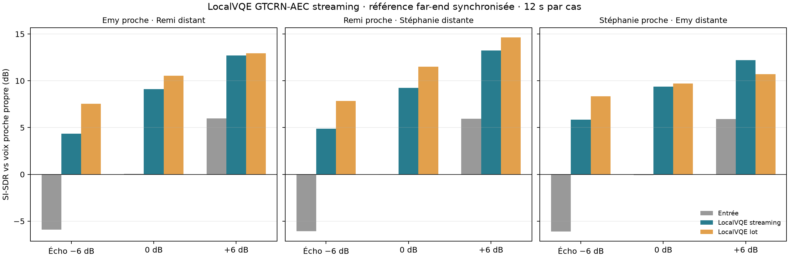
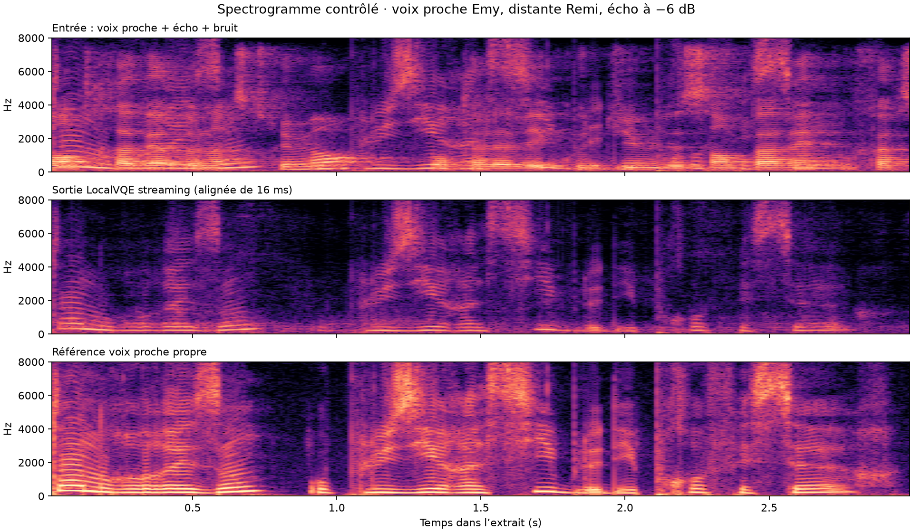

# Écran duplex LocalVQE en streaming — 2026-10-09

## Question

Le modèle compact LocalVQE peut-il enlever en temps réel un écho de haut-parleur tout en préservant plusieurs voix proches sur un CPU ancien ? L'essai vise une décision de faisabilité, pas une comparaison directe à Adobe Podcast ni une validation produit.

## Configuration et protocole

- Poids `localvqe-pi-v1-49k-f32.gguf` (environ 2,3 MB), bibliothèque C officielle `localvqe_process_frame_f32`, build GGML CPU.
- Hôte : Intel Core i7-6700K @ 4 GHz. Audio mono 16 kHz, trames de 256 échantillons (16 ms). Chaque clip dure 12 s; le temps mesuré couvre l'inférence en streaming, hors démarrage, chargement et conversion.
- Trois voix proches (Emy, Remi, Stéphanie) croisées avec les deux autres voix en far-end. L'écho synthétique est créé par une réponse impulsionnelle déterministe de 40 ms + queue aléatoire décroissante de 320 ms, puis mélangé à −6, 0 ou +6 dB relativement à la voix proche. Un bruit d'ambiance connu est ajouté à environ 25 dB de SNR. La voix sèche proche constitue la cible.
- Le modèle est réinitialisé entre les neuf cas. Le protocole appelle l'API streaming avec blocs successifs de 256 échantillons. La sortie de ce chemin a un délai fixe d'un hop (256 échantillons / 16 ms); tous les calculs d'alignement et de niveau sont faits après compensation de ce délai connu. Les WAV locaux restent dans `results/localvqe-controlled-aec-2026-10-09/` et ne sont pas requis pour reproduire le code du produit.

## Résultats

Sur les neuf mélanges, le gain SI-SDR après alignement est de **+6,29 à +11,96 dB**, médiane **+9,27 dB**. Le facteur temps réel médian est **0,165** (environ 6,1× temps réel sur ce CPU). La sortie streaming est proche du résultat batch : écart SI-SDR médian **−1,41 dB** (min/max observés : environ −3,21 / +1,49 dB).

Ces scores ne suffisent pas à accepter le modèle. SI-SDR est invariant à l'échelle et masque une forte baisse du niveau de voix. À 0 dB écho/voix, le RMS global de la sortie réelle référence est de −27,6 / −27,6 / −26,5 dBFS (Emy / Remi / Stéphanie), contre −23,1 / −23,4 / −22,4 dBFS à l'entrée. La référence silencieuse en streaming donne −23,9 / −24,0 / −23,1 dBFS. La voie réelle référence entraîne donc environ 4,5 / 4,1 / 4,1 dB de baisse RMS globale dans ces cas.

Un diagnostic par fenêtres de 20 ms, limité aux fenêtres où la cible sèche dépasse −45 dBFS, confirme une suppression variable de la parole. Le gain de projection cible/sortie médian (p10–p90) pour la vraie référence est :

| Voix proche | Référence d'écho à 0 dB | Gain projeté p10 / médiane / p90 |
|---|---|---:|
| Emy | Remi | −27,9 / −16,6 / −14,2 dB |
| Remi | Stéphanie | −9,7 / −5,3 / −4,2 dB |
| Stéphanie | Emy | −6,4 / −2,5 / −1,7 dB |

Le mode référence silencieuse a lui aussi une perte médiane (−14,4 / −4,2 / −1,9 dB, même ordre des voix), et la vraie référence augmente la perte pour certaines fenêtres faibles. Il ne s'agit donc pas d'un simple problème de gain de sortie : un gain automatique pourrait remonter aussi les résidus et artefacts, sans reconstruire les syllabes supprimées. La très forte différence selon la voix signale une fragilité inter-locuteurs à examiner.

## Décision

**Ne pas intégrer ce modèle au chemin live ou fichier utilisateur pour le moment.** Le débit CPU est prometteur et le SI-SDR s'améliore, mais la préservation de la voix varie trop et l'essai n'établit pas une qualité naturelle ou proche d'Adobe. Aucun post-gain correctif n'est appliqué.

Le prochain écran utile doit séparer explicitement les causes : (1) répéter le test avec reverb enregistrée ou convoluée à partir de réponses impulsionnelles documentées et un corpus de voix plus large; (2) vérifier l'API de référence, sa polarité, sa mise à l'échelle et son état/reset; (3) mesurer SI-SDR, SI-SDRi, erreur d'enveloppe, gain de parole par fenêtres, intelligibilité et résidu d'écho; (4) ne retenir que les profils sans fenêtres de parole fortement supprimées. L'architecture live du dépôt reçoit actuellement seulement le micro mono 48 kHz/480 samples, sans flux de référence synchronisé. L'intégration nécessite un vrai transport duplex et une gestion de dérive d'horloge distincts.

Les données synthétiques présentes sont volontairement un écran réduit de trois voix. Le chemin ne compare pas à Adobe et ne permet pas de conclure à un remplacement universel. Ces limites sont centrales à l'interprétation des résultats.

## Reproduction

Scripts exploratoires locaux : `.tools/localvqe-screen/run_controlled_aec.py` pour l'API batch et `.tools/localvqe-screen/run_controlled_aec_stream.py` pour l'API streaming. La bibliothèque et les poids sont stockés dans le dossier local ignoré `.tools/localvqe-screen/`. Le modèle amont est distribué sous Apache-2.0 : [LocalVQE](https://github.com/localai-org/LocalVQE), [poids](https://huggingface.co/LocalAI-io/LocalVQE).
