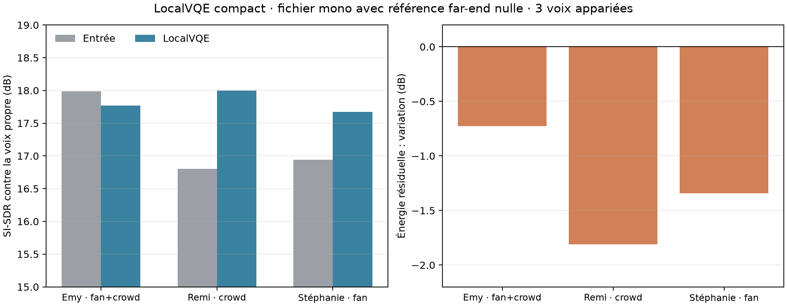

# Écran LocalVQE compact avec référence silencieuse (2026-10-09)

## Question

LocalVQE annonce une petite ligne GTCRN-AEC (49 k paramètres) adaptée aux CPU modestes, mais sa documentation demande une référence far-end synchronisée. Peut-on quand même l'utiliser sur un fichier mono en passant une référence nulle, pour obtenir un début de suppression de bruit/déréverbération ? Cet essai répond seulement à cette question expérimentale; il ne valide pas un usage AEC.

## Protocole

- LocalVQE `localvqe-pi-v1-49k-f32.gguf`, API C officielle, build GGML CPU Release.
- Référence de far-end = zéro pour toute la durée. L'initialisation du modèle a confirmé le backend GTCRN et le front-end DAF intégré.
- Trois prises de 15 s, voix intacte + bruit synthétique de ventilateur, foule ou mélange, à un SNR actif de 18 dB. Les trois ont des références propres et des stems de bruit connus. Le corpus est décrit dans `corpus/samples/clear-noisy-mix-01/manifest.json`.
- Rééchantillonnage polyphasé entrée/références à 16 kHz; comparaison SI-SDR après projection à gain optimal contre le speech propre. Le résiduel est calculé après retrait de cette projection de voix; il contient le bruit restant **et** les erreurs/artefacts du modèle.
- CPU de ce poste : Intel Core i7-6700K @ 4 GHz. Mesure mono, API batch, temps modèle seul, hors conversion de fichiers et démarrage.

## Résultats

| Clip | SI-SDR entrée | SI-SDR sortie | Gain SI-SDR | Gain optimal voix sortie | Changement RMS du résiduel | Durée modèle | RTF |
|---|---:|---:|---:|---:|---:|---:|---:|
| Emy · ventilateur + foule | 17.99 dB | 17.77 dB | −0.22 dB | −0.96 dB | −0.73 dB | 2.396 s | 0.160 |
| Remi · foule | 16.80 dB | 18.00 dB | +1.20 dB | −0.61 dB | −1.81 dB | 2.412 s | 0.161 |
| Stéphanie · ventilateur | 16.94 dB | 17.67 dB | +0.73 dB | −0.61 dB | −1.34 dB | 2.405 s | 0.160 |

La sortie est calculée en environ 16 % de la durée audio sur ce CPU précis. Le modèle réduit le résiduel de 0.7 à 1.8 dB; l'amélioration SI-SDR va de −0.22 à +1.20 dB. Ce gain est mesurable mais petit, et l'un des trois exemples se dégrade légèrement. Le niveau optimal de voix baisse d'environ 0.6 à 1.0 dB, donc un éventuel gain de réduction se paie aussi par un niveau de voix plus bas.

## Décision

**Ne pas ajouter LocalVQE comme étape automatique du pipeline fichier.** En référence silencieuse, ce modèle conjoint n'est pas un remplaçant convaincant du denoiser actuel : le gain est faible et variable, et le protocole ne teste pas son usage normal. Il demeure une piste séparée pour le mode microphone duplex lorsque le flux de lecture distant peut fournir la référence exigée. Le résultat temps réel CPU est encourageant pour l'architecture légère, mais ne compense pas la faible amélioration qualitative observée ici.

Ce mini-écran ne compare pas à Adobe Podcast, ne comprend que trois voix avec bruit ajouté, et n'évalue pas les queues de réverbération. Il ne permet donc pas de conclure à une proximité studio ou une qualité universelle. Il faut garder les conclusions des benchmarks Adobe/DPDFNet séparées.

## Contrôle duplex avec la vraie référence

Pour distinguer « fichier mono sans référence » du vrai cas AEC, le même binaire a ensuite été exécuté sur les deux fichiers `dt_mic.wav` et `dt_ref.wav` de la démo officielle LocalVQE (10 s, 16 kHz). Le maximum de corrélation normalisée en valeur absolue entre sortie micro et référence de lecture, recherché sur ±500 ms, vaut 0.0721 à l'entrée, 0.0672 avec référence nulle, et 0.0160 avec référence réelle. La référence réelle réduit nettement cette corrélation sur cet exemple; ce proxy ne constitue pas un ERLE, car le fichier ne fournit pas de cible voix proche isolée. Le traitement a pris 1.652 s (RTF 0.165) sur le CPU de test.

Cette observation justifie un essai d'intégration **duplex** distinct, mais pas une modification du traitement fichier. L'adaptateur live actuel ne reçoit que des trames mono 48 kHz/480 samples; `LiveEngine.capture()` et `LiveBackend.process()` n'ont pas de champ de référence. LocalVQE attend des paires micro/référence synchronisées à 16 kHz/256 samples. Il faut d'abord transmettre réellement le flux de lecture et traiter son alignement/dérive d'horloge. Une référence artificielle nulle ou non synchronisée annule le bénéfice AEC observé ici.

## Reproduction

Le code, le modèle et leurs poids ont été clonés/téléchargés dans `.tools/localvqe-screen/` (zone locale ignorée par Git). Le modèle fait environ 2.3 MB. Le projet amont est sous Apache-2.0. Le benchmark a utilisé un petit adaptateur Python `ctypes` autour de `localvqe_new_with_frontend` et `localvqe_process_f32`; les sorties WAV sont conservées localement à côté des échantillons, sans être nécessaires pour le build produit.

Références amont : [dépôt LocalVQE](https://github.com/localai-org/LocalVQE), [poids et modèle LocalVQE](https://huggingface.co/LocalAI-io/LocalVQE).
