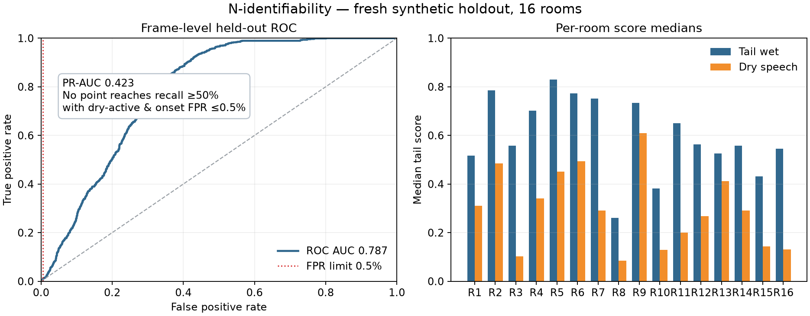

# M / N: conservative tail detector and identifiability audit

**Decision: stop the learned post-Cap60 tail-detector family on this synthetic protocol.** This is a bounded engineering result, not evidence of Adobe parity or of universal dereverberation.

## M — frozen detector preflight

The M candidate used a 65-feature causal TCN with two output heads (`p_tail`, `p_speech`) and a fixed −4 dB gain gate after two consecutive frames with `p_tail ≥ 0.95` and `p_speech ≤ 0.05`. It trained for 2,000 updates on 24 synthetic wet and 12 synthetic dry fixtures, then evaluated on 8 new wet and 8 new dry fixtures. Training/evaluation used disjoint seed namespaces. Runtime target was the installed NVIDIA GTX 1050 Ti (4 GB).

| Measurement | Result | Frozen gate |
|---|---:|---:|
| W1 median 150–300 Hz reduction, wet EVAL | 0.000 dB | ≥2.0 dB |
| W1 positive fixtures | 0/8 | ≥7/8 |
| Gate activations on wet EVAL | 0 frames in every fixture | Enough to meet W1 gate |
| Median `p_tail` on labeled tail frames | 0.444 (range 0.176–0.515) | Fixed threshold 0.95 |
| Dry active/onset actuation | 0% / 0% | ≤0.5% each |
| Dry speech level change | exactly 0 dB | Active p50 ±0.25 dB |
| Exact-zero checks | 100/100 | 100/100 |
| Finite outputs and metrics | pass | required |

M therefore preserved dry speech by doing nothing; it did not reduce tails. Two independent runs on the GTX 1050 Ti had identical JSON metrics after excluding device metadata. No post-result threshold or training changes were made.

## N — fresh identifiability diagnostic

Following the pre-agreed GPT Web protocol, N does not synthesize or transform any output audio. It asks whether the frozen M labels/features can separate tail frames from non-tail and dry speech at all. It generated 16 new synthetic training rooms and 16 disjoint test rooms with new sources, RIRs, and seeds. The fixed probe was train-only standardization plus L2 logistic regression (`C=1`, balanced classes, LBFGS); no model or threshold search was performed. A threshold scan on the held-out scores was used only as an existence diagnostic, never as a candidate product setting.

| Measurement | Held-out result | Pre-registered interpretation |
|---|---:|---:|
| ROC-AUC | **0.7871** | `<0.85` means stop |
| PR-AUC | 0.4233 | descriptive |
| Tail frames / valid frames | 942 / 4,016 | 41–78 tail frames per room; median duration 0.472 s |
| Ambiguous frames | 0 | diagnostic |
| Median tail score | 0.597 | descriptive |
| Median dry-active score | 0.259 | descriptive; room-wise scores overlap substantially |
| Safe operating point | **none** | Must reach ≥50% tail recall and ≤0.5% FPR on both dry-active and onset |
| Overall decision | **STOP_TAIL_DETECTOR_FAMILY** | ROC-AUC `<0.85` and no safe point |

The held-out probe was repeated with identical results. The visual comparison shows that tail scores trend higher, but the overlap with dry speech is too broad to select a safe operating threshold.



## Engineering caveat found during audit

The shared M feature extractor scales spectral flux by the maximum flux over the *whole utterance*. That uses future samples and is not causal for a streaming implementation. N intentionally reused the M feature definition unchanged to test the frozen proposal; its AUC therefore cannot be interpreted as a deployable real-time score. Since identifiability already fails even with this utterance-level normalization, this caveat does not rescue the family. A future unrelated study would need a new, causal feature definition and a fresh pre-registered split.

## Scope and reproducibility

- Both runs use generated synthetic speech and generated RIRs only.
- No corpus, prior DEV/HOLDOUT, Adobe recording, or `/home/yohan/Bureau/test.wav` was read.
- N writes no audio files.
- The raw machine-readable run records used for the tables are emitted by the commands below; the N diagnostic output can be saved with `--output`.

```bash
.venv/bin/python scripts/benchmarks/universal_enhancer/compact_dereverb/audit_m_tail_gate.py \
  --device cuda --output /tmp/m-tail-gate.json
.venv/bin/python scripts/benchmarks/universal_enhancer/compact_dereverb/audit_n_identifiability.py \
  --output /tmp/n-identifiability.json
```

The M audit SHA-256 was `ba265d55170830c81a616a7d94b18085f438c0c25e2894efa6ca98035f47cc3d`; N audit SHA-256 was `d389c2b87e80ce995fd6fab2edb76b9c3baf3de87ff4c3c47b0f892bf5e04857`.

## Conclusion

Under these generated-room conditions, the available features do not separate late tails from speech safely enough for the proposed conservative gain gate. The bounded result is to stop this learned tail-detector branch. It does not show that all dereverberation methods fail, and it does not establish how closely VoxRefine matches Adobe Podcast. Further progress requires a genuinely different evidence source or mechanism, not post-hoc tuning of this detector on the consumed synthetic evals.
