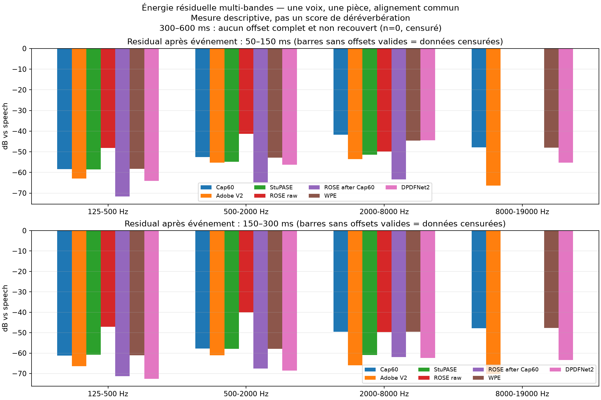

# Écoute utilisateur : comparaison des familles de moteurs — 2026-10-10

## Résultat humain

Retour d'écoute sur le pack mono 48 kHz du dossier local `results/user-recording-test-2026-10-09/model-family-comparison-02/` :

| Rendu | Retour d'écoute |
|---|---|
| DeepFilterNet Cap60 | Réverbération de la pièce encore audible |
| StuPASE | Voix trop compressée |
| ROSE-CD brut | Réverbération encore audible |
| ROSE-CD après Cap60 | Réverbération encore audible |
| WPE | Réverbération encore audible |
| DPDFNet2 après Cap60 | Réverbération encore plus audible |

Conclusion produit : **aucun de ces candidats ne passe le critère perceptif de réduction de la pièce**. StuPASE est aussi rejeté pour son timbre comprimé. Ce test ne justifie aucun changement du preset de production.

## Révision de la mesure

Le précédent score `RMS 5,79–5,94 s` n'était qu'une mesure d'énergie dans un segment terminal de 150 ms. Il mélange bruit, réponse de pièce, parole faible et artefacts; ce n'est ni une mesure d'RT60, ni un score fiable de sensation de pièce. Sur la nouvelle segmentation de ce clip, l'événement final se termine vers 5,64 s. Il ne reste aucun segment complet et non recouvert pour la fenêtre 300–600 ms; ce résultat doit être censuré, pas remplacé par zéro.

Une lecture diagnostique multi-offsets a été générée depuis les rendus existants avec une activité détectée sur l'entrée brute commune (20 ms RMS > 3,5 % du pic de l'entrée), un gain constant par rendu pour égaliser la parole au niveau actif de Cap60, des fenêtres post-parole censurées dès qu'une autre parole survient et quatre bandes. Les médianes descriptives, en dB relativement au niveau de parole commun, sont :

| Fenêtre après événement | n | Cap60 | Adobe V2 | StuPASE | ROSE brut | ROSE après Cap60 | WPE | DPDFNet2 |
|---|---:|---:|---:|---:|---:|---:|---:|---:|
| 50–150 ms | 1 | −26,77 | −42,39 | −40,64 | −20,45 | −27,16 | −39,00 | −43,64 |
| 150–300 ms | 1 | −26,49 | −42,48 | −42,78 | −19,00 | −26,64 | −39,45 | −58,51 |
| 300–600 ms | 0 | censuré | censuré | censuré | censuré | censuré | censuré | censuré |

## SRMR, vérifié sur des paires à vérité connue

J'ai ajouté le SRMR (Speech-to-Reverberation Modulation Energy Ratio) depuis l'implémentation de référence [SRMRpy](https://github.com/jfsantos/SRMRpy), commit `fee009779cef96bed34db3a7e31d10f3ad1ea133`, qui indique des essais à 8 et 16 kHz. Les signaux 48 kHz ont donc été convertis à 16 kHz avant calcul. Pour vérifier le sens du score dans cet environnement, j'ai d'abord comparé deux paires déjà présentes dans le corpus Clarity local : chaque paire comprend un stem sec et sa version réverbérée alignée, de même locuteur et de même durée.

| Paire connue (3 s) | SRMR sec | SRMR réverbéré | Différence |
|---|---:|---:|---:|
| T005_CH2_00450, room12 | 5,374 | 3,175 | −2,200 |
| T005_CH2_00450, room8 | 5,374 | 2,368 | −3,007 |

Sur le clip utilisateur, calculé après l'unique mise à niveau constante déjà décrite :

| Rendu | SRMR original | SRMR normalisé |
|---|---:|---:|
| Cap60 | 7,507 | 5,521 |
| Adobe V2 | 6,901 | 5,593 |
| StuPASE | 8,228 | 5,922 |
| ROSE brut | 6,735 | 5,122 |
| ROSE après Cap60 | 7,476 | 5,690 |
| WPE | 7,610 | 5,581 |
| DPDFNet2 | 7,519 | 5,531 |

Le score confirme qu'il peut répondre à une différence de réverbération connue, mais il ne reproduit pas le jugement d'écoute sur ce clip : le SRMR original favorise StuPASE malgré sa compression audible, tandis que la version normalisée varie d'environ 0,8 point seulement et place Adobe au-dessus de DPDFNet2 de 0,06. Ce n'est pas un classement perceptif fiable, ni une mesure directe de RT60 ou de profondeur de pièce. Bruit, réduction de bruit, compression, bande passante et artefacts changent aussi le spectre de modulation. Les versions sont donc conservées comme axes de diagnostic séparés; aucun réglage de traitement n'est choisi en les maximisant.

## Ripple spectrale sur la voix voisée

Pour sonder la coloration pendant la voix (plutôt que dans les pauses), j'ai utilisé le même masque de trames voisées dérivé uniquement de l'entrée brute : 40 ms, pas de 10 ms, RMS supérieur à 3,5 % du pic, autocorrélation normalisée d'au moins 0,35 sur la plage 70–300 Hz. Sur chaque rendu, la puissance spectrale moyenne de ces mêmes 230 trames est convertie en log-fréquence, une enveloppe large de 0,12 octave est lissée, puis l'écart-type du résidu est mesuré entre 250 Hz et 7 kHz.

Avant lecture de la comparaison utilisateur, ce descripteur a été contrôlé avec le même calcul sur deux paires alignées du corpus local :

| Signal de référence connu (T005_CH2_00450) | Ripple SD sec | Ripple SD réverbéré | P90 absolu sec → réverbéré |
|---|---:|---:|---:|
| room12 | 2,600 dB | 2,811 dB | 4,318 → 4,752 dB |
| room8 | 2,600 dB | 2,922 dB | 4,318 → 4,927 dB |

Les deux paires augmentent dans le sens attendu, mais cela ne valide pas l'indice comme score universel : il mesure aussi les formants, le contenu phonétique, lissage fréquentiel et coloration des modèles. Sur les rendus utilisateur :

| Rendu | Ripple SD | P90 absolu |
|---|---:|---:|
| Cap60 | 2,861 dB | 4,733 dB |
| Adobe V2 | 2,587 dB | 4,288 dB |
| StuPASE | 2,248 dB | 3,816 dB |
| ROSE brut | 2,121 dB | 3,482 dB |
| ROSE après Cap60 | 2,256 dB | 3,723 dB |
| WPE | 2,839 dB | 4,657 dB |
| DPDFNet2 | 2,863 dB | 4,715 dB |

Lecture prudente : StuPASE et ROSE lissent davantage la structure spectrale que l'audio Adobe de référence, ce qui colle au retour « compressé/étouffé » pour StuPASE et au fait que ROSE reste perçu comme réverbérant malgré son faible indice. WPE et DPDFNet2 gardent une ripple semblable à Cap60, mais le DPDFNet2 est justement perçu comme plus « pièce ». L'indice aide donc à séparer un axe de lissage/coloration de l'axe de réverbération perçue; il ne donne pas le traitement à appliquer.

Le graphique correspondant est conservé à côté du pack local : `results/user-recording-test-2026-10-09/model-family-comparison-02/voiced_spectral_ripple.png`.

## Dynamique d'amplitude, contrôle de l'impression « compressée »

Sur le même masque brut commun (431 trames actives de 20 ms) et après égalisation RMS constante, j'ai mesuré l'écart P90–P10 du RMS de trame et le facteur de crête médian :

| Rendu | RMS P90–P10 | Facteur de crête médian |
|---|---:|---:|
| Cap60 | 14,934 dB | 10,278 dB |
| Adobe V2 | 16,691 dB | 9,076 dB |
| StuPASE | 16,707 dB | 10,321 dB |
| ROSE brut | 15,389 dB | 9,446 dB |
| ROSE après Cap60 | 16,897 dB | 9,560 dB |
| WPE | 16,001 dB | 10,289 dB |
| DPDFNet2 | 15,662 dB | 10,161 dB |

Ces statistiques n'étayent pas une compression globale de StuPASE sur cette phrase : la dynamique de ses trames est proche d'Adobe et son facteur de crête médian proche de Cap60. Son caractère « compressé » à l'écoute semble donc davantage lié au timbre, au lissage ou aux artefacts génératifs qu'à un simple écrasement de l'enveloppe RMS. Il reste possible qu'une compression locale/non linéaire ne soit pas capturée par ces deux résumés; ce clip ne permet pas d'en identifier la cause.

## Test de filtre court : stable ou reconstruction variable ?

Pour départager une correction de réflexions cohérente d'un changement de texture plus variable, j'ai pris Cap60 comme entrée commune `x` et chaque rendu existant comme `y`. Après alignement par corrélation (fenêtre de recherche ±100 ms, interpolation du pic à sous-échantillon), le test mesure la cohérence complexe input/output sur les mêmes segments voisés, la variabilité de `Y/X` d'une fenêtre à l'autre, puis la part de la sortie prédite hors segments d'entraînement par un FIR causal de 50 ms. Le filtre est ajusté sur deux groupes d'événements et testé sur le troisième; les plis tournent sur les six événements.

Le solveur FIR a été calibré avant interprétation sur un signal sec local auquel seules deux réflexions précoces connues ont été ajoutées (8 ms à −8 dB, 23 ms à −14 dB, sans queue tardive). Avec des fenêtres fréquentielles de 100 ms, le contrôle donne une cohérence médiane de 0,975 en 300–3000 Hz et 0,988 en 3000–7900 Hz; les trois R² FIR hors pli valent 0,99885–0,99992. Ça vérifie le comportement du contrôle pour une convolution courte stable. Ce contrôle ne prouve pas que toute réverbération de pièce soit un FIR court.

| Rendu | Cohérence 300–3k | Cohérence 3–7,9k | R² FIR 50 ms, hors pli | Énergie cepstrale 2–50 ms |
|---|---:|---:|---:|---:|
| Cap60 | 1,000 | 1,000 | 0,99997 | 0,000 |
| Adobe V2 | 0,842 | 0,815 | 0,83163 | 0,482 |
| StuPASE | 0,151 | 0,138 | −0,13241 | 0,221 |
| ROSE brut | 0,847 | 0,844 | 0,66731 | 0,020 |
| ROSE après Cap60 | 0,911 | 0,865 | 0,72231 | 0,021 |
| WPE | 0,997 | 0,999 | 0,99906 | 0,865 |
| DPDFNet2 | 1,000 | 1,000 | 0,99944 | 0,517 |

Le R² représente ici uniquement la prédiction d'une sortie à partir de Cap60 sur les segments exclus de l'ajustement; ce n'est pas une note de qualité. Lecture utile par rapport aux retours d'écoute :

- **DPDFNet2 et WPE** restent presque entièrement explicables par un filtre court stable, mais gardent une forte énergie cepstrale à 2–50 ms. Ils sont donc très cohérents avec l'entrée tout en conservant une coloration qui peut trahir la pièce. Cela cadre avec votre impression de réverbération persistante pour ces deux rendus; ce n'est pas une preuve causale.
- **ROSE** réduit presque à zéro l'indice cepstral, mais reste perçu comme réverbérant. Ce proxy n'isole donc pas la réverbération; ROSE change aussi la texture/spectre et ne se réduit pas bien à un FIR stable.
- **StuPASE** a la cohérence et le R² les plus faibles, ce qui confirme un changement de signal important que ne décrivent ni le niveau RMS ni SRMR. Son caractère compressé à l'écoute n'est pas celui d'un simple compresseur statique; il s'agit d'une transformation beaucoup moins fidèle à une convolution fixe.
- **Adobe V2** est intermédiaire : davantage de transformation non linéaire que WPE/DPDFNet2, mais une sortie encore partiellement prévisible depuis Cap60.

La figure cohérence–R² est gardée localement avec les données du pack : `results/user-recording-test-2026-10-09/model-family-comparison-02/short_filter_explainability.png`. Les résultats par pli et les paramètres sont dans `short_filter_explainability.json` et `.csv`. Le script reproductible est [`analyze_short_filter_explainability.py`](../../scripts/benchmarks/universal_enhancer/analyze_short_filter_explainability.py).

La contradiction la plus instructive est conservée : DPDFNet2 est environ 32 dB plus bas que Cap60 sur l'unique offset mesurable entre 150 et 300 ms, mais il est perçu comme plus réverbérant. **La mesure ne classe donc pas la sensation entendue.** Une réduction d'énergie de pause ne prouve pas une suppression des réflexions précoces ou du filtrage en peigne pendant les phonèmes; un timbre artificiel peut même être perçu comme une pièce plus présente. Ces explications restent des hypothèses à départager, pas une attribution causale sur ce clip mono.

Les bandes au-dessus de 8 kHz sont marquées comme non prises en charge pour StuPASE et ROSE-CD, exécutés à 16 kHz puis rééchantillonnés pour le pack. Le rééchantillonnage n'ajoute pas de contenu au-dessus de leur bande native; leurs niveaux HF ne sont donc pas rapportés comme des mesures comparables.

## Prochaine étape

1. Garder ces sept rendus comme comparaison historique, sans retoucher les gains ou la chaîne.
2. Séparer les trois questions dans les prochains rapports : énergie résiduelle sur plusieurs pauses, coloration/modulation pendant les voyelles, et préservation des attaques/consonnes.
3. Garder SRMR comme indicateur auxiliaire sur plusieurs voix/pièces, avec les paires alignées sèches/réverbérées pour contrôler la direction et les mesures intrusives (ERLE/DRR/RT60 proxy, préservation de parole) là où les stems existent.
4. Ne faire une inférence avec un nouveau moteur qu'après avoir vérifié poids, provenance et licence. VoiceFixer est déjà cloné localement, mais son rapport antérieur note que le checkpoint téléchargé n'a pas satisfait le checksum annoncé; il ne doit pas être rechargé. StoRM est cloné, mais aucun checkpoint n'est présent localement et ses poids distribués séparément n'ont pas été audités. Aucun des deux n'est actuellement un candidat exécutable/promouvable.
5. Pour `test.wav`, sans stem sec Adobe ni réponse impulsionnelle, les métriques restent des indicateurs partiels. Le fichier n'a pas été téléversé ni partagé.

GPT Web a recommandé d'abandonner le RMS terminal comme score principal et d'ajouter SRMR, coloration spectrale, préservation de la voix et explicabilité par filtre court. Cette passe ajoute ces métriques sur les rendus déjà locaux. Les contrôles montrent que chaque axe sépare des phénomènes différents mais ne suffit pas à établir une cause perceptive. La réverbération présente dans l'entrée brute rend plusieurs pauses non mesurables selon la règle conservatrice; il reste seulement 1/1/0 offsets complets selon la fenêtre. Le nombre d'offsets mesurables est trop faible pour une conclusion statistique.

Le script reproductible est [`analyze_model_family_room_perception.py`](../../scripts/benchmarks/universal_enhancer/analyze_model_family_room_perception.py). Les CSV/JSON/PNG et WAV liés à l'enregistrement restent en local sous `results/` et ne sont pas ajoutés au dépôt.

## Limites

- Une personne, une voix, une pièce, un clip d'environ 6,2 s; offsets corrélés, pas d'intervalle de confiance.
- Le niveau de référence est le RMS actif de Cap60, appliqué par un seul gain constant à chaque sortie; chaque sortie garde son propre traitement.
- Les bandes calculées ne séparent pas le champ direct de la réverbération.
- Pas de score universel de qualité ni de revendication de parité Adobe v2.
- Les avis d'écoute sont la cible fonctionnelle; les valeurs spectrales ne les remplacent pas.
