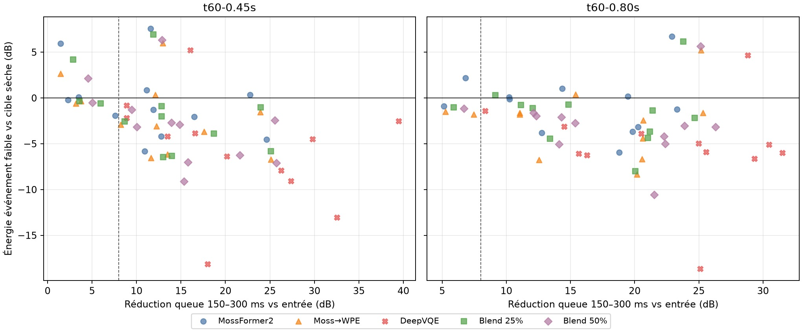

# MossFormer2 → WPE et blends DeepVQE : holdout dé-réverb (2026-10-09)

## Résumé décisionnel

Le gain de WPE observé sur `test.wav` ne se reproduit pas sur les 24 exemples RIR contrôlés. Avec un réglage WPE gelé, MossFormer2→WPE n'ajoute qu'environ **0,7–0,8 dB** de suppression médiane dans la fenêtre 150–300 ms, atténue la voix faible d'environ **1,6–1,7 dB de plus**, et remonte l'énergie de queue 300–600 ms d'environ 0,8–1,3 dB. Le temps WPE médian dépasse le temps audio (RTF CPU 1,24–1,62 selon la pièce). Cette baseline mono n'est donc pas retenue comme amélioration produit.

Le blend MossFormer2 + 25 % DeepVQE ajoute environ **0,9–1,5 dB** de suppression médiane 150–300 ms, mais son p10 de niveau événementiel atteint −6,3 dB pour T60 .45 s et −4,4 dB pour T60 .80 s. Le blend 50 % améliore davantage la queue, mais perd plus de voix faible. Le checkpoint DNS3 local a une licence de redistribution non établie : aucun de ces rendus ne peut être livré comme modèle produit.

## Protocole gelé

- VCTK, quatre locuteurs tenus à l'écart des précédents réglages, trois phrases par locuteur, deux RIR synthétiques à décroissance T60 .45 s et .80 s : **24 entrées RIR-only** de 3 s.
- L'événement faible de 250 ms est atténué de 18 dB et le signal cible sec est mis exactement à zéro après l'événement. Cela fournit une référence de parole faible et des queues de pièce connues sans parole sèche suivante.
- MossFormer2 SE 48 kHz est appliqué à chaque entrée sur GTX 1050 Ti. Ensuite, WPE mono est appliqué sans recherche d'hyperparamètres : STFT 1024, hop 256, 32 taps, délai 3 trames, 3 itérations, régularisation 1e−6.
- DeepVQE DNS3 est appliqué au MossFormer2 ramené à 16 kHz puis rééchantillonné à 48 kHz. Deux mélanges waveform fixes (25 % et 50 %) sont calculés à l'alignement du fichier d'origine; le décalage d'enveloppe mesuré est 0 ms sur les 24 fichiers. Il s'agit d'un écran exploratoire, pas d'une implémentation redistribuable.
- Douze contrôles secs (une paire par phrase) ont aussi été traités par MossFormer2→WPE pour mesurer la préservation hors RIR.

## Résultats appariés

Valeurs agrégées sur 12 événements par profil; plus de suppression de queue est favorable, tandis que les écarts de voix négatifs signalent une énergie moindre que la cible sèche. Ces mesures d'énergie sont des diagnostics, pas des scores d'intelligibilité.

| RIR | Chaîne | Suppression 150–300 ms vs entrée | Suppression 300–600 ms vs entrée | Énergie événement faible vs cible sèche | P10 attaque 0–40 ms vs cible | RTF WPE CPU médian |
|---|---|---:|---:|---:|---:|---:|
| T60 .45 s | MossFormer2 | 11,36 dB | 16,65 dB | −0,74 dB | −2,51 dB | — |
|  | MossFormer2 → WPE | 12,18 dB | 15,85 dB | −2,23 dB | −3,62 dB | 1,62 |
|  | MossFormer2 → DeepVQE 25 % | 12,84 dB | — | −1,51 dB | −3,85 dB | — |
|  | MossFormer2 → DeepVQE 50 % | 14,40 dB | — | −2,80 dB | −5,78 dB | — |
| T60 .80 s | MossFormer2 | 16,56 dB | 22,64 dB | −0,50 dB | −5,25 dB | — |
|  | MossFormer2 → WPE | 17,79 dB | 21,75 dB | −1,79 dB | −7,23 dB | 1,24 |
|  | MossFormer2 → DeepVQE 25 % | 17,45 dB | — | −1,23 dB | −6,85 dB | — |
|  | MossFormer2 → DeepVQE 50 % | 18,44 dB | — | −2,89 dB | −8,79 dB | — |

Les p10 ci-dessus indiquent le dixième percentile des niveaux d'attaque mesurés. WPE ajoute seulement ~1 dB de suppression médiane à 150–300 ms et **augmente** la queue 300–600 ms médiane de 0,79 dB (T60 .45) et 0,89 dB (T60 .80) par rapport à MossFormer2 seul. Il baisse aussi l'énergie de l'événement faible de 1,61/1,70 dB médian supplémentaire. Les attaques p10 sont inférieures de 3,43/3,68 dB à celles de MossFormer2 sur les deux profils.

DeepVQE plein niveau a une suppression médiane de queue 150–300 ms de 19,06/25,04 dB, mais l'énergie événementielle médiane est −4,35/−5,50 dB et le p10 tombe à −12,66/−6,60 dB. Un fort chiffre de queue peut donc refléter la perte de voix. Le blend 25 % limite la perte médiane, sans passer de façon uniforme le seuil prudent de conservation des attaques et événements faibles.

## Contrôles secs et vitesse

Sur les 12 contrôles secs, MossFormer2→WPE conserve l'énergie de l'événement faible à −0,07 dB médian vs la cible et l'attaque à −0,23 dB. Après l'endpoint sec numérique, WPE génère un résidu autour de −88 dBFS entre 50–150 ms et −93,9 dBFS entre 150–300 ms; MossFormer2 était au plancher PCM. Ce résidu est très bas, mais montre que la chaîne ne laisse pas le silence strict.

MossFormer2 a mis 7,12 s pour 72 s de RIR-only audio sur le GPU (RTF 0,099, chargement 3,27 s). WPE a mis 111,3 s pour ce même lot sur CPU (RTF moyen 1,55, médianes par profil dans le tableau). Dans les contrôles secs, WPE a un RTF moyen 1,23. Cette version ne convient pas au direct CPU; accélérer WPE ne corrigerait toutefois pas le faible gain qualité mesuré ici.

## Conclusion et prochaine étape

WPE mono après MossFormer2 est conservé comme comparateur reproductible, pas comme nouveau profil. L'écoute et les métriques du seul `test.wav` avaient montré une queue plus faible; le holdout démontre que ce comportement n'est pas fiable selon la voix et la salle synthétique. Le blend DeepVQE n'offre qu'un gain médian modeste au niveau 25 %, avec des pertes de parole faible encore trop dispersées et une licence de poids inconnue. Aucun candidat testé ici ne justifie une promesse de parité Adobe.

La prochaine passe doit chercher un modèle de dé-réverbération explicitement entraîné pour préserver l'early speech, vérifier la licence du checkpoint exact avant distribution, puis le comparer sur une cohorte neuve dry/RIR et sur les trois paires Adobe déjà acquises. Le critère reste le compromis par locuteur/pièce : attaque et événement faible d'abord, queue ensuite, et spectre en diagnostic seulement.

## Artefacts

Les entrées/stems, WAV de sortie, chronométrages par clip et manifestes restent sous `results/noise-rir-truth-01/vctk-rir-dereverb-truth-01/mossformer2-wpe-screen-01/` (résultats locaux ignorés par Git). Les scripts reproductibles sont :

- `scripts/benchmarks/universal_enhancer/benchmark_mossformer2_wpe_dereverb.py`
- `scripts/benchmarks/universal_enhancer/benchmark_mossformer2_wpe_dry_controls.py`
- `scripts/benchmarks/universal_enhancer/benchmark_deepvqe_blend_dereverb.py`

VCTK est distribué sous CC BY 4.0. Le code DeepVQE utilisé est MIT; la licence du checkpoint DNS3 local n'est pas claire, il n'est pas destiné à être redistribué.
