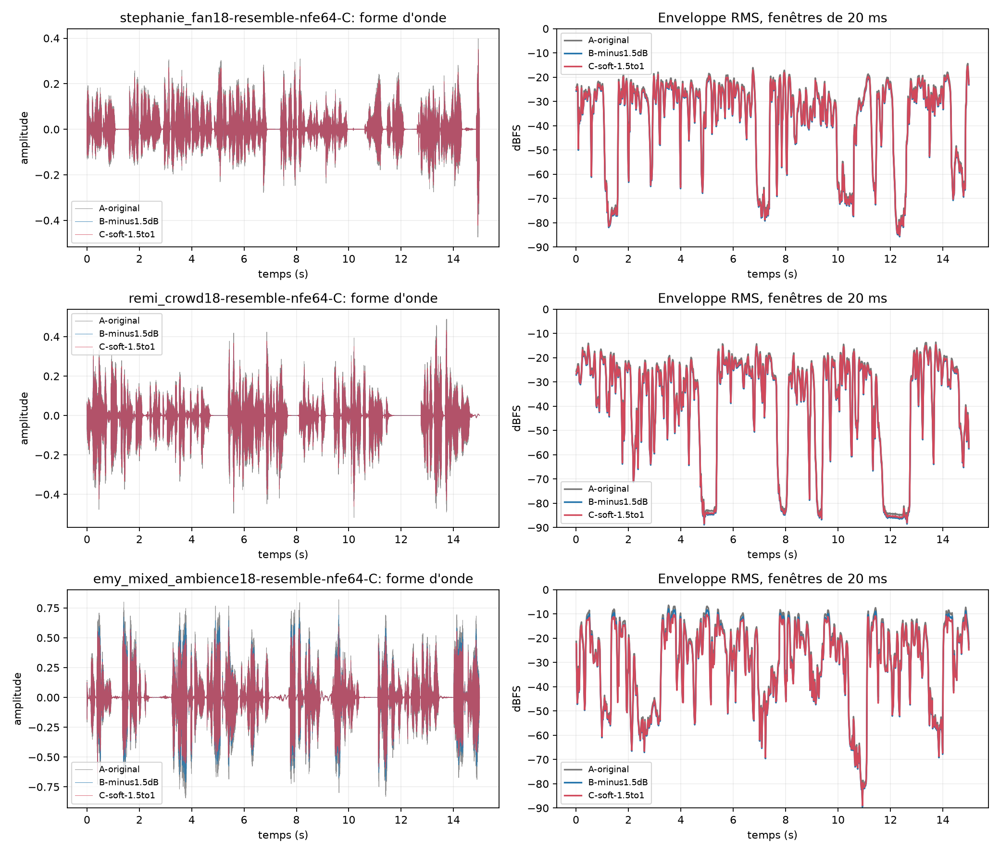

# Niveau de sortie et contrôle doux des crêtes — 9 octobre 2026

## Question

Les derniers rendus NFE64-C paraissent encore un peu trop forts et plus pointus qu'Adobe Podcast. Cet écran garde les rendus IA intacts et ne change que leur niveau de sortie ou leur enveloppe dynamique. Il sert à mesurer ces deux effets séparément, pas à conclure qu'une courbe de forme d'onde plus petite est une meilleure voix.

## Variantes écoutables

Sur les trois exemples français de 15 secondes à SNR actif mesuré de 18 dB :

- **A — Original** : rendu NFE64-C actuel, trims aigus déjà appliqués.
- **B — −1,5 dB** : même rendu multiplié par un gain fixe. La forme et le rapport crête/moyenne ne changent pas.
- **C — Crêtes douces** : compresseur descendant léger sur RMS 20 ms (seuil −15 dBFS, ratio 1,5:1, attaque 8 ms, relâchement 100 ms), puis gain fixe de −1 dB.

Les WAV PCM24 et mesures détaillées sont dans les résultats locaux ignorés par Git : `results/clear-noisy-mix-01/level-screen-01/`. Reproduction :

```bash
.venv/bin/python scripts/benchmarks/universal_enhancer/level_smoothing_screen.py \
  --input results/clear-noisy-mix-01/audio/stephanie_fan18-resemble-nfe64-C.wav \
  --input results/clear-noisy-mix-01/audio/remi_crowd18-resemble-nfe64-C.wav \
  --input results/clear-noisy-mix-01/audio/emy_mixed_ambience18-resemble-nfe64-C.wav \
  --output-dir results/clear-noisy-mix-01/level-screen-01
```



Sur Stéphanie et Rémi, le compresseur de C intervient très peu : C se comporte surtout comme une baisse fixe de 1 dB. Sur Emy, qui contient les crêtes les plus fortes, il retire jusqu'à 2,9 dB de gain dynamique avant le trim fixe. Le niveau de crête mesuré passe de −1,43 à −3,54 dBFS; le RMS global passe de −16,14 à −18,51 dBFS. B baisse à la fois crête et RMS de 1,5 dB exactement et laisse le crest factor inchangé. C est donc l'essai utile pour dompter les passages ponctuellement forts; B est le réglage prévisible si tout le rendu paraît simplement trop fort.

## Comparaison Adobe appariée

Christiane événement 1 fournit un court test avec entrée, NFE64-C et véritable sortie Adobe v2 pour le même événement. Les rendus ont la même durée et restent alignés au début. La figure montre les enveloppes RMS à leurs niveaux d'origine; elle ne met pas les amplitudes à l'échelle pour les faire sembler identiques.


Sur la fenêtre de parole de référence de 1,30 à 1,48 s, les RMS déjà mesurés sont −31,73 dBFS pour NFE64-C et −31,67 dBFS pour Adobe : seulement 0,06 dB d'écart. Sur l'événement complet, Adobe a un RMS supérieur de 1,22 dB, mais son RMS médian des fenêtres de 20 ms est inférieur de 4,13 dB. Cela correspond à un contraste différent entre parole et silence, plutôt qu'à une baisse uniforme du niveau parlé. Les mesures et limites de ce test sont documentées dans [la comparaison Adobe de Christiane](adobe-pair-christiane-event-1.md).

La mesure spectrale antérieure sur cet événement trouvait NFE64-C environ +0,92 dB au-dessus d'Adobe dans 4–8 kHz et +3,97 dB dans 8–16 kHz après égalisation du niveau parlé pour comparer les formes spectrales. Ce résultat d'un seul événement motive une vérification de la brillance sur d'autres voix; il ne justifie pas encore un EQ fixe universel. Voir [le rapport spectral apparié](adobe-pair-christiane-event-1.md).

## Décision

Le gain fixe de −1,5 dB répond au retour d'écoute sur le niveau, mais ne lisse pas la forme d'onde. Le compresseur réduit les passages forts ponctuels et s'active peu sur les deux autres voix. Ni l'un ni l'autre ne reproduit à lui seul la différence Adobe observée entre parole et silences. Je conserve donc ces variantes comme options de comparaison et ne fais pas du compresseur un défaut universel sur la base de trois exemples synthétiques.

La version courante utilise le débruitage et le timbre identiques aux originaux. Le test n'ajoute ni latence au moteur produit ni modèle IA; le compresseur de mesure est une implémentation NumPy de référence, à porter dans le moteur temps réel uniquement après sélection du comportement cible.
