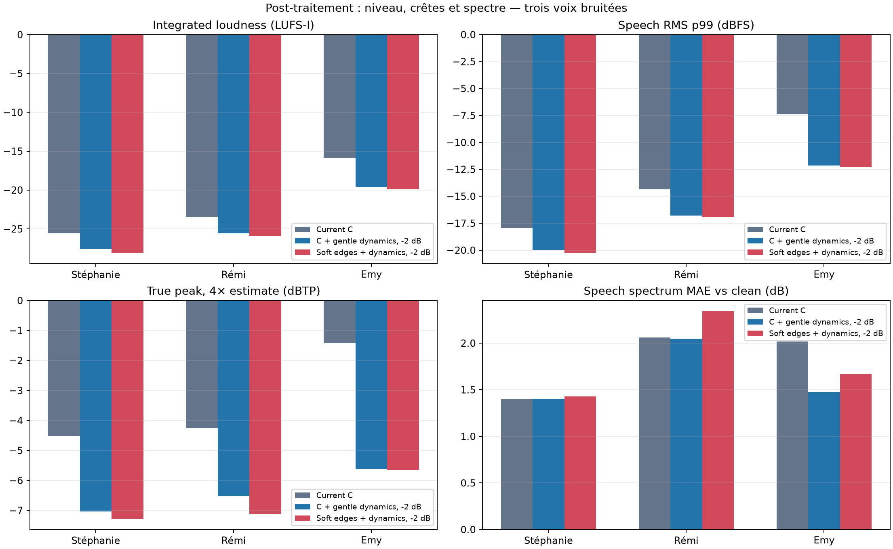
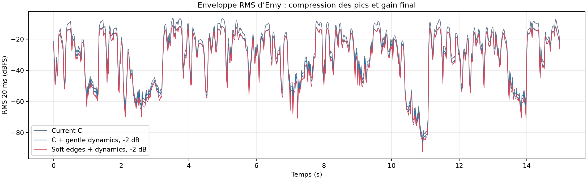

# Level and peak finishing screen — 2026-10-09

This screen compares the current NFE64-C renders with a conservative finishing
stage: a 20 ms RMS detector, 10 ms attack, 120 ms release, 6 dB soft knee,
threshold −16 dBFS and ratio 1.5:1, followed by fixed −2 dB output attenuation.
The tone stage is still independently selectable. The compressor is applied
after Resemble tone shaping and before the optional DeepFilterNet pass; the
fixed attenuation is applied last.

## Result on three held voices

| Voice / noise | LUFS-I before → after | speech p99 RMS (dBFS) before → after | true peak 4× (dBTP) before → after | level-matched spectral MAE vs clean before → after |
| --- | ---: | ---: | ---: | ---: |
| Stéphanie / fan | −25.57 → −27.59 | −17.95 → −19.99 | −4.51 → −7.04 | 1.399 → 1.401 dB |
| Rémi / crowd | −23.42 → −25.58 | −14.37 → −16.77 | −4.26 → −6.52 | 2.061 → 2.048 dB |
| Emy / fan + crowd | −15.86 → −19.62 | −7.39 → −12.16 | −1.42 → −5.62 | 2.018 → 1.478 dB |

For Emy, the compressor also lowers the speech RMS p90 from −10.47 to
−14.33 dBFS. This is the clearest case of a large peak reduction. The other two
voices are changed mainly by the fixed −2 dB gain, with little spectral-shape
change. The optional `soft-edges` shelf plus this stage measured 1.67 dB
spectral MAE on Emy, so it was not made the default tone profile.





## Does another denoiser remove the crackle?

A second DeepFilterNet pass at 6 and 18 dB attenuation was screened after the
new C + compressor stage on all three renders. It did not materially change
speech level; on Emy, level-matched spectral MAE increases only from 1.48 dB
to 1.56 dB, with similarly small changes on the other two voices. True peak
and speech p99 barely change further. This
does not demonstrate click/crackle removal, so a second denoiser remains
optional and is not enabled by the default profile.

On the paired Adobe v2 sample, NFE16-C did not cross the compressor threshold,
so its level-matched spectral MAE stayed at 3.92 dB; fixed gain changes
loudness only. Emy true peak before finishing was −1.42 dBTP, so this is not
sample clipping. Lower output level and softer phrase peaks can make residual
artifacts less prominent, but neither operation repairs artifacts created by
the enhancer. A listening check is still needed to confirm whether the user's
specific crackle is less audible.

## Reproduction

The metric runner reads existing NFE64-C files and exact clean stems. It does
not run the neural enhancer. All generated WAV/MP3 files and full-precision
metrics stay under the ignored `results/post-denoise-finish-01/` directory.

```sh
.tools/resemble-venv/bin/python \
  scripts/benchmarks/universal_enhancer/post_denoise_finish_screen.py
```

Metrics: [`CSV complet`](data/post-denoise-finish-metrics-2026-10-09.csv) et
[`rapport JSON avec SHA-256 et versions`](data/post-denoise-finish-report-2026-10-09.json).
The active-speech mask comes from the clean reference using 20 ms RMS, a
−35 dB threshold relative to its maximum, and ±60 ms dilation. Spectral MAE is
computed on speech-active spectra after matching the candidate's median active
RMS to the clean reference. True peak is estimated by 4× oversampling. These
are diagnostics, not perceptual quality scores. The holdout is only three
voices; the stored Resemble checkpoint was unavailable for a fresh inference.

## Product setting

`studio-resemble` now defaults to `--dynamics gentle --output-gain-db -2`.
Choose `--dynamics off` or `--output-gain-db 0` to disable either part. Gain is
applied after optional post-denoising and is restricted to −12…0 dB. The gentle
compressor is a finishing stage, not a de-crackler or denoiser. `--tone
soft-edges` remains a separate tonal option.
