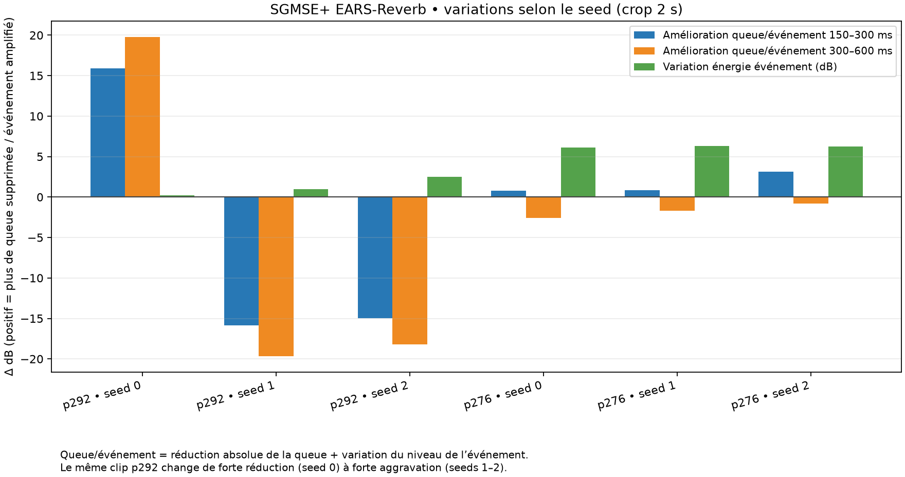

# SGMSE+ EARS-Reverb 48 kHz — screen dereverb

Date: 2026-10-09
Purpose: screen a model trained explicitly for dereverberation, after WPE and DeepVQE failed the VoxRefine preservation/robustness checks. This is a research screen, not a product evaluation or an Adobe parity claim.

## Summary

The official SGMSE+ EARS-Reverb checkpoint can suppress late energy on some synthetic room responses, but the result is highly seed- and voice-dependent. On the same `p292` reverberant crop, seed 0 reduced the tail relative to the event by about 15.9 dB (150–300 ms) and 19.8 dB (300–600 ms), while seeds 1 and 2 increased it by about 15–20 dB. The same model also moves event level by several dB on dry controls and creates a nonzero residual after digital silence.

At the official sampler configuration, a 2 s crop took 56.7–57.0 s on the GTX 1050 Ti (RTF ≈28.4). It is not a live candidate on this machine. Full 3 s inference exceeded the available 4 GiB VRAM. Therefore SGMSE is rejected for the live path and not suitable as a deterministic VoxRefine default. This screen does not establish that the model is unusable in every offline setting; it shows that this checkpoint/configuration is not robust enough for the intended automatic pipeline.

## Model and provenance

- Upstream implementation: [sp-uhh/sgmse](https://github.com/sp-uhh/sgmse), whose repository describes score-based generative models for speech enhancement and dereverberation.
- Exact weight: upstream README's SGMSE+ EARS-Reverb 48 kHz checkpoint, Drive ID `1PunXuLbuyGkknQCn_y-RCV2dTZBhyE3V` ([upstream checkpoint instructions](https://github.com/sp-uhh/sgmse#pretrained-checkpoints)). The repository code is MIT-licensed, but the README does not state a separate license for this downloaded checkpoint. It is not included in VoxRefine and must not be redistributed until its weight license is clarified.
- Upstream revision: `1961cf4`.
- Checkpoint SHA-256: recorded in `results/sgmse-ears-reverb-screen-01/frozen-crop-manifest.json` (local research artifact; checkpoint itself is intentionally not in Git).
- Sampler frozen to the official enhancement path: PC reverse-diffusion predictor + ALD corrector, `N=30`, 1 corrector step, `snr=0.5`, seed 0 for the first three-voice screen. Follow-up seed screen uses seeds 1 and 2, with all other settings unchanged. No EQ, MossFormer cascade, blend, or post-processing.
- Runtime: GTX 1050 Ti, 4 GiB. SGMSE ran in the local Python 3.13 / PyTorch 2.6.0+cu124 research environment. The official pure-PyTorch `upfirdn2d` fallback was used to avoid compiling the optional CUDA extension.

## Inputs and protocol

We used the existing known-dry VCTK/RIR validation set at `results/noise-rir-truth-01/vctk-rir-dereverb-truth-01/inputs/`. Each 3 s, mono, 48 kHz utterance has a dry control and a matched synthetic RIR render. The first screen used a 2 s crop from 1.0 to 3.0 s to fit the GPU. The input was divided by the maximum absolute sample of the *full 3 s file* before cropping and the same scalar was restored after inference. Event and tail windows were fixed in absolute utterance time; there was no event-local normalization.

For the first screen, the vocal event was 1.25–1.50 s after utterance start. Tail windows were 1.65–1.80 s and 1.80–2.10 s. We report both absolute tail suppression and the tail-to-event change. Positive `tail/event improvement` means the output has less late energy relative to its event than the input:

```text
tail/event improvement (dB)
  = 10 log10(E_tail,input / E_tail,output)
    + 10 log10(E_event,output / E_event,input)
```

This avoids mistaking a global/event-level change for dereverberation. For dry controls, the tail windows are effectively digital silence; those ratios are censored and should not be interpreted as a finite dereverb score. The measured output residual floor is reported separately.

### Seed-0 screen

| Voice / condition | Event level change | Tail/event improvement 150–300 ms | Tail/event improvement 300–600 ms | RTF |
|---|---:|---:|---:|---:|
| p276, dry | −0.15 dB | censored: dry digital silence | censored: dry digital silence | 28.49 |
| p276, RIR T60 0.80 s | +6.12 dB | +0.78 dB | −2.56 dB | 28.38 |
| p292, dry | +3.59 dB | censored: dry digital silence | censored: dry digital silence | 28.40 |
| p292, RIR T60 0.45 s | +0.18 dB | +15.87 dB | +19.77 dB | 28.37 |
| p341, dry | +2.74 dB | censored: dry digital silence | censored: dry digital silence | 28.37 |
| p341, RIR T60 0.80 s | +8.42 dB | +11.79 dB | +4.57 dB | 28.34 |

The p230 T60 0.45 s pilot, run separately with the same 2 s crop procedure, had dry event change −2.95 dB and RIR tail/event improvement +5.36 dB (150–300 ms) and +11.60 dB (300–600 ms). This case is included as a pilot only, not in the three-voice seed chart.

### Seed sensitivity on two voices

The second screen compared seeds 0/1/2 on p292 and p276, using the same 2 s crops, same absolute event/tail windows, same sampler and model. Seed-0 values come from the first screen; seed-1 and seed-2 rows were rerun separately.

| Voice / condition | Seed | Event change | Tail/event improvement 150–300 ms | Tail/event improvement 300–600 ms | Output peak |
|---|---:|---:|---:|---:|---:|
| p292, dry | 0 | +3.59 dB | censored | censored | −13.46 dBFS |
| p292, dry | 1 | +3.88 dB | censored | censored | −12.84 dBFS |
| p292, dry | 2 | +4.21 dB | censored | censored | −12.92 dBFS |
| p292, RIR | 0 | +0.18 dB | **+15.87 dB** | **+19.77 dB** | −9.94 dBFS |
| p292, RIR | 1 | +0.95 dB | **−15.88 dB** | **−19.64 dB** | −11.28 dBFS |
| p292, RIR | 2 | +2.52 dB | **−14.94 dB** | **−18.22 dB** | −10.23 dBFS |
| p276, dry | 0 | −0.15 dB | censored | censored | −11.51 dBFS |
| p276, dry | 1 | −1.15 dB | censored | censored | −0.62 dBFS |
| p276, dry | 2 | −2.42 dB | censored | censored | −3.23 dBFS |
| p276, RIR | 0 | +6.12 dB | +0.78 dB | −2.56 dB | −5.02 dBFS |
| p276, RIR | 1 | +6.33 dB | +0.84 dB | −1.67 dB | −5.03 dBFS |
| p276, RIR | 2 | +6.25 dB | +3.14 dB | −0.78 dB | −5.42 dBFS |

The p292 seed-0 improvement reverses sign and becomes a 15–20 dB relative tail increase for seeds 1 and 2. The p276 result remains weak in 150–300 ms and worsens in 300–600 ms for all three seeds. The p276 dry peak also changes by almost 11 dB between seeds 0 and 1, even though its event window changes by only about 1 dB. No run clipped, but this uncontrolled peak variation is another warning for product output gain and artifacts.



## Compute and context limits

- 2 s GPU inference took 56.7–57.0 s: RTF 28.34–28.49, far slower than real time.
- Peak PyTorch allocation was about 1.65 GiB; reserved memory about 2.25 GiB.
- The full 3 s utterance failed on the 4 GiB GPU when a further 288 MiB allocation was requested and only about 252 MiB were available. The desktop uses the same GPU, so no desktop applications were terminated to make room.
- The full-utterance/context sensitivity check (2 s versus 3 s) is therefore incomplete. Crops are acceptable for an initial screen because the scored windows lie inside the crop, but they are not equivalent to whole-utterance inference.
- A CPU full-utterance run had previously been interrupted after more than four minutes without finishing a 3 s clip. CPU is not a practical substitute for this checkpoint/configuration.

## Decision

1. Do not add SGMSE to the live path: measured GTX 1050 Ti RTF is about 28.
2. Do not add it as an automatic offline default: the dereverb gain reverses sign across seeds on the same input, while dry event levels and peaks move substantially.
3. Do not cascade it after MossFormer2 yet. A cascade would obscure whether these failures come from the SGMSE sampler itself or from a changed input distribution.
4. Retain the model/results only as a research baseline. We have not tested it on the user's real reverberant recording or compared against Adobe in this screen.

## Next direction

Stop searching for a seed or a post-EQ that makes one result look good. The next technically sound path is a deterministic, discriminative dereverberator trained on known dry speech convolved with varied measured/synthetic room impulse responses. Train with a preservation-first objective: strong loss on direct/early speech and weak events, plus a moderate loss on late reverberant energy. Evaluate on speakers and RIRs held out by identity, report dry controls and onset/weak-event preservation, then test the user's recording only as an external listening case. Keep the current noise suppression and gentle EQ as separate, unchanged stages during that experiment.

This does not promise Adobe V2 parity. It is the first next path that directly addresses the observed failure: existing generic enhancement models either leave the room tail, suppress phonemes, or produce unstable generative outputs.

## Reproduction artifacts

- Frozen first-screen metrics: `results/sgmse-ears-reverb-screen-01/frozen-crop-metrics.csv`
- First-screen manifest (includes checkpoint SHA-256 and runtime details): `results/sgmse-ears-reverb-screen-01/frozen-crop-manifest.json`
- Seed-screen metrics: `results/sgmse-ears-reverb-screen-01/context-seed-check/metrics.csv`
- Context/seed runner: `scripts/benchmarks/universal_enhancer/bench_sgmse_ears_reverb_seed_check.py` (uses the downloaded external checkpoint and is not a product dependency)
- First-screen runner: `scripts/benchmarks/universal_enhancer/bench_sgmse_ears_reverb_screen.py`
