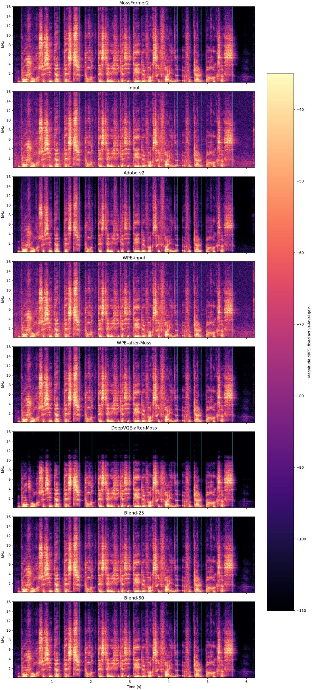
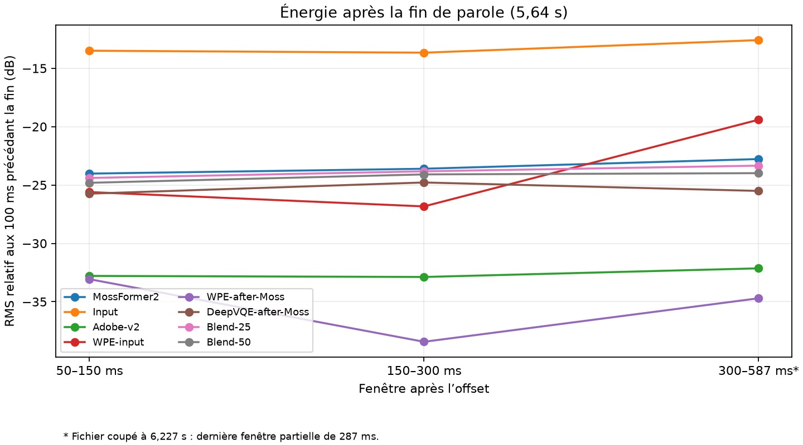

# Dé-réverbération sur l'enregistrement utilisateur (2026-10-09)

## Résumé

La réduction du ventilateur par MossFormer2 fonctionne, mais le test révèle encore de l'énergie après les fins de parole. Adobe v2 réduit nettement davantage cette énergie temporelle. Une WPE mono appliquée après MossFormer2 est le candidat local le plus prometteur de cet écran : sur la fin de phrase, son énergie relative entre 50 et 150 ms est proche d'Adobe, et elle est plus basse qu'Adobe entre 150 et 300 ms. Son plancher de longue pause reste environ 6,6 dB plus haut qu'Adobe. Cette mesure unique ne suffit pas à établir une équivalence perceptive. Le holdout de 24 événements RIR qui a suivi ne reproduit pas ce gain : WPE après MossFormer2 ne réduit la queue que d’environ 1 dB de plus que Moss seul, tout en abaissant davantage la voix faible. Le détail est dans [le screen multi-voix avec cibles sèches](mossformer2-wpe-deepvqe-holdout-2026-10-09.md).

DeepVQE plein niveau ne réduit pas la queue autant que WPE sur cet enregistrement. Les blends waveform à 25 % et 50 % ne donnent ici qu'un changement faible par rapport à MossFormer2. Aucun candidat n'est activé par défaut.

## Données et traitement

- Même enregistrement, 6,227 s, ramené en mono 48 kHz; les canaux source étaient identiques.
- Comparateurs : entrée, sortie Adobe Podcast Enhance v2 du même enregistrement, MossFormer2, WPE mono sur l'entrée et après MossFormer2, DeepVQE après MossFormer2, et mélanges fixes MossFormer2/DeepVQE 75/25 et 50/50.
- WPE : fréquence 48 kHz, STFT 1024, hop 256, 32 taps, délai de prédiction 3 trames, 3 itérations, régularisation 1e-6; traitement mono hors ligne.
- DeepVQE : checkpoint local DNS3 non redistribuable faute de licence claire, inférence CPU à 16 kHz puis rééchantillonnage à 48 kHz. C'est une expérience locale seulement.
- Pour l'écoute, chaque sortie a reçu un gain fixe afin d'aligner son RMS médian sur les trames actives de MossFormer2. Aucun EQ ni compresseur n'a été appliqué. Les fichiers bruts restent aussi conservés.
- Les régions de parole et offsets ont été déterminés une seule fois depuis MossFormer2, pas depuis chaque candidat. Les mesures de queue sont rapportées relativement aux 100 ms précédant la fin de parole. Une fenêtre qui recoupe le prochain onset est censurée.

## Mesures à l'offset final

La parole se termine à environ 5,64 s. Le fichier ne contient que 587 ms après cette fin; la dernière fenêtre mesure donc 287 ms, pas 300 ms complets. Les fenêtres sont normalisées par la parole juste avant l'offset : plus la valeur est négative, plus la queue mesurée est faible.

| Sortie | 50–150 ms | 150–300 ms | 300–587 ms | RMS longue pause, dBFS* |
|---|---:|---:|---:|---:|
| Entrée | −13,5 dB | −13,7 dB | −12,6 dB | −41,5 |
| MossFormer2 | −24,0 dB | −23,6 dB | −22,8 dB | −50,4 |
| Adobe v2 | −32,8 dB | −32,9 dB | −32,1 dB | −62,2 |
| WPE sur entrée | −25,6 dB | −26,8 dB | −19,4 dB | −49,0 |
| **WPE après MossFormer2** | **−33,1 dB** | **−38,4 dB** | **−34,7 dB** | **−55,6** |
| DeepVQE après MossFormer2 | −25,7 dB | −24,8 dB | −25,5 dB | −51,4 |
| Blend 25 % | −24,4 dB | −23,8 dB | −23,3 dB | −50,6 |
| Blend 50 % | −24,8 dB | −24,1 dB | −24,0 dB | −50,7 |

\* La longue pause inclut le bruit résiduel, la réverbération et le bruit de quantification; ce n'est pas une mesure isolée du bruit ou du T60.

Dans une pause intérieure de 150 ms autour de 2,03 s, la fenêtre 50–150 ms vaut −15,1 dB pour MossFormer2, −29,9 dB pour Adobe, −22,0 dB pour WPE après MossFormer2 et −17,8 dB pour DeepVQE. Cette pause unique donne une comparaison cohérente, mais le nombre d'événements est trop faible pour régler un modèle.

À titre de vitesse, WPE a pris 6,93 s pour 6,23 s d'audio sur CPU (RTF 1,11), donc il ne tient pas le temps réel avec ces paramètres. DeepVQE a pris 1,84 s de calcul modèle (RTF 0,30); ce chiffre exclut chargement, conversion et ne prouve pas un fonctionnement streaming.

## Visuels

Les spectrogrammes montrent le contenu temps-fréquence à une échelle commune; ils ne prouvent pas à eux seuls une baisse de réverbération. La courbe d'offset est ici plus informative : elle montre si l'énergie continue après la fin de parole.

## Écoutes niveau apparié

Les exports PCM sont sous `results/user-recording-test-2026-10-09/dereverb-analysis-01/`. Les WAV bruts des traitements sont sous `results/user-recording-test-2026-10-09/dereverb-screen-01/`.

## Limites et suite

Il n'existe pas de prise sèche appariée de cet enregistrement. On ne peut donc pas calculer un vrai RT60, un DRR ou une perte de phonèmes fiable à partir de ce seul fichier. Adobe est une référence de rendu, pas une cible propre. L'estimation d'offsets dépend aussi du VAD de MossFormer2; les pauses de conversation peuvent contenir des consonnes ou de la voix faible.

GPT Web recommande de conserver WPE comme témoin explicable, de tester MossFormer2→WPE sans balayage de paramètres, puis seulement un blend DeepVQE modéré si les métriques d'attaque le tolèrent. Il souligne que le spectre moyen confond coloration, suppression du ventilateur et décroissance temporelle. La présente passe confirme que WPE après débruitage mérite une écoute, tandis que les blends DeepVQE testés apportent peu sur cet exemple.

Prochaine étape : écouter le comparatif à niveau identique, puis répéter le protocole sur les paires sèches/RIR connues déjà dans `noise-rir-truth-01`. Seuls des résultats stables sur plusieurs voix et plusieurs pièces justifieront une intégration. WPE reste hors temps réel dans cette configuration.

Le script d'analyse est `scripts/benchmarks/universal_enhancer/analyze_user_recording_dereverb.py`; il prend un signal de référence débruité, plusieurs sorties appariées, fixe une seule carte de speech offsets, censure les fenêtres interrompues par un onset, puis écrit CSV, JSON, lecteurs niveau apparié et graphiques.
